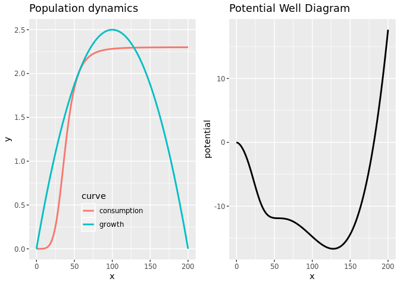
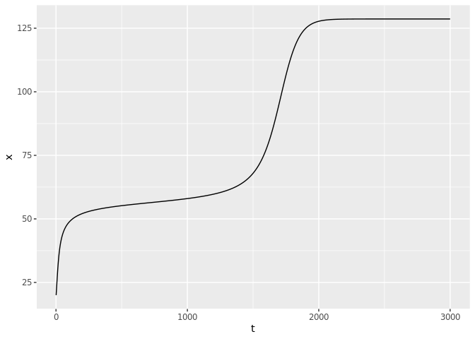
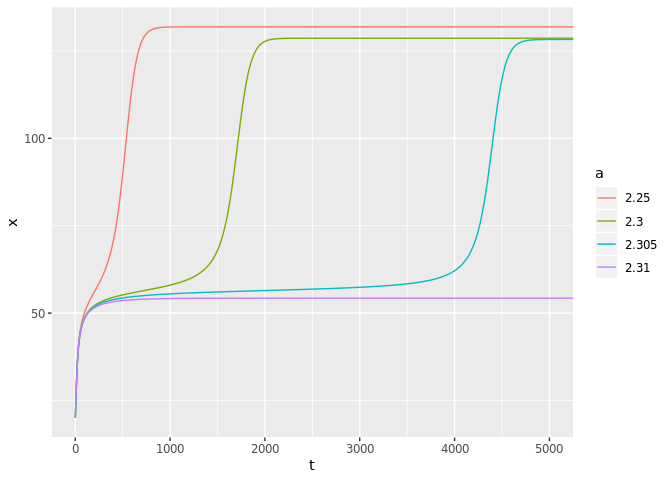
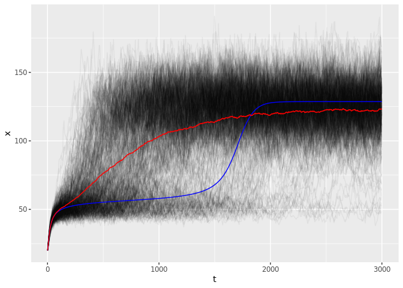
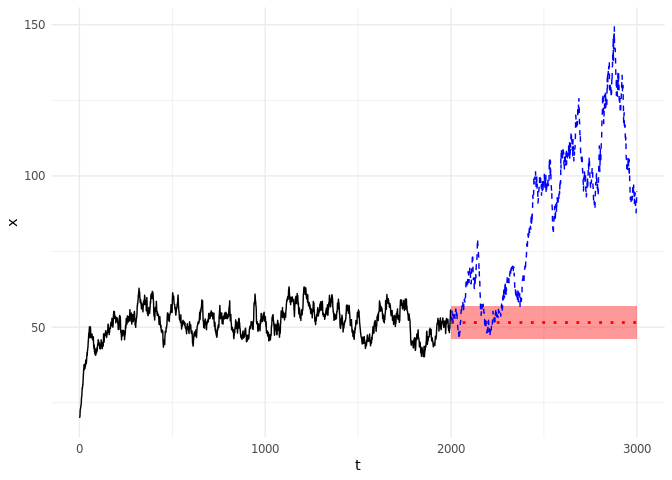
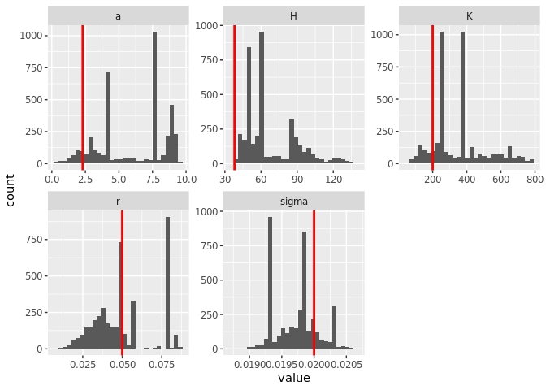
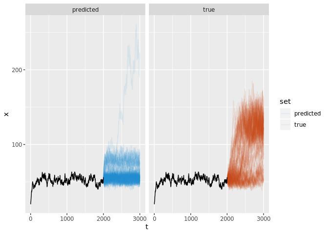

Appendix
================
Carl Boettiger

``` r
library(tidyverse)
library(patchwork)
library(ggthemes)
library(furrr)

library(greta)
tensorflow::use_session_with_seed(12345)
```

## Model Definition

``` r
p <- list(r = .05, K = 200, Q = 5, H = 38, sigma = .02, a=2.3, N = 3e3, x0 = 20)
```

``` r
growth <- function(x, p) x * p$r * (1 - x / p$K)
consumption <- function(x, p) p$a * x ^ p$Q / (x^p$Q + p$H^p$Q)
may <- function(x, p) x + growth(x,p) - consumption(x,p)
```

``` r
theory <- 
  function(p){
    tibble(x= seq(0,p$K, length.out = 100)) %>%
    mutate(growth = growth(x,p), 
           consumption = consumption(x,p)) %>%
    mutate(potential = - cumsum(growth - consumption)) %>%
    gather(curve, y, -x, -potential) 
}
```

Plots of the growth rate functions and the potential well diagram

``` r
fig_a <- theory(p) %>%
  ggplot(aes(x, y, col=curve)) +
  geom_line(lwd=1) + 
  labs(title = "Population dynamics") +
  theme(legend.position = c(.5, .2), legend.background = element_blank())

fig_b <- theory(p) %>%
  ggplot(aes(x, potential)) + 
  geom_line(lwd=1)  + 
  labs(title = "Potential Well Diagram")

fig_a + fig_b
```

<!-- -->

## Model simulations

``` r
# Generic simulator routine
sim <- function(f, p){
  x <- numeric(p$N)
  x[1] <- p$x0
  dBt <- numeric(p$N)
  if(p$sigma > 0) dBt <- rnorm(p$N, 0, p$sigma)
  for(t in 1:(p$N-1)){
    x[t+1] <- max(f(x[t], p) + x[t] * dBt[t], 0)
  }
  data.frame(t = 1:p$N, x)
}
```

Deterministic simulations:

``` r
p_det <- p
p_det$sigma <- 0
det <- sim(may,p_det) 
det %>% ggplot(aes(t, x)) + geom_line() 
```

<!-- -->

Compare deterministic simulations across a range of `a` values:

``` r
a <- c(2.25, 2.30, 2.305, 2.31)
names(a) <- a
p_det$N <- 1e4
df <- map_dfr(a, function(a){
  p_det$a <- a
  sim(may, p_det)
},
.id = "a")

df %>% ggplot(aes(t,x, col = a)) + geom_line() + coord_cartesian(xlim=c(0,5000))
```

<!-- -->

Stochastic replicate simulations (run in parallel):

``` r
plan("multisession")
system.time({
  sim_data <- future_map_dfr(1:500, function(reps) sim(may, p), .id = "reps")
})
```

    ##    user  system elapsed 
    ##   1.186   0.094   9.490

``` r
p_det$N <- 3e3
det <- sim(may,p_det) %>% mutate(reps=1)
mean <- sim_data %>% group_by(t) %>% summarise(x = mean(x)) %>% mutate(reps = 1)
```

## Stochastic ensemble mean vs deterministic mean

``` r
write_csv(sim_data, "../../data/ghost_sims.csv.gz")
sim_data %>% group_by(reps) %>%
  sample_n(5e2) %>%
  ggplot(aes(t, x, group=reps)) + 
  geom_line(alpha=0.05) +
  geom_line(data = det, color = "blue") + 
  geom_line(data = mean, color = "red")
```

<!-- -->

-----

# ARIMA Forecast

``` r
library(tidyverse)
library(stats)
```

Extract a series with relatively long
ghost:

``` r
means <- sim_data %>% group_by(reps) %>% summarise(ave = mean(x), max = max(x))
lows <- means %>% filter(ave < mean(ave) - 3*sd(ave), max > 120) %>% pull(reps)
```

``` r
x <- sim_data %>% filter(reps == lows[[1]], t <= 2000) %>% pull(x) %>% as.ts() 
fit <- arima(x)
y <- predict(fit, n.ahead = 1000) %>% as.data.frame()
y <- bind_rows(data.frame(pred = x, se = 0), y)
```

    ## Warning in bind_rows_(x, .id): Vectorizing 'ts' elements may not preserve
    ## their attributes
    
    ## Warning in bind_rows_(x, .id): Vectorizing 'ts' elements may not preserve
    ## their attributes
    
    ## Warning in bind_rows_(x, .id): Vectorizing 'ts' elements may not preserve
    ## their attributes

``` r
arima_forecast <- sim_data %>% 
  filter(reps == lows[[1]]) %>% 
  select(t,x) %>%
  bind_cols(y)

write_csv(arima_forecast, "../../data/arima_forecast.csv.gz")
```

``` r
train <- arima_forecast %>% filter(t < 2000) 
test <- arima_forecast %>% filter(t > 2000) 
train %>%
  ggplot(aes(t)) + 
  geom_line(aes(y=x)) +
  geom_line(aes(y=pred), lwd = 1, lty = 3, col = "red", data = test) + 
  geom_ribbon(aes(y=pred, ymin=pred-se, ymax=pred+se), 
              alpha = 0.4, fill = "red", data = test)  + 
  geom_line(aes(y=x), data = test, lty = 2, col="blue") +
  xlim(0,3000) + ylab("x") + theme_minimal()
```

<!-- -->

-----

# Model-based forecast

``` r
library(greta)
```

Bayesian estimate on training data only:

``` r
wide <- select(train, x) %>% as.matrix() 
n <- dim(wide)[1]
x_t1 <- wide[-1,]
x_t <- wide[-n,] 
```

``` r
a <- uniform(0, 10)
r <- uniform(0, 4 * p$r)
Q <- uniform(0, 4 * p$Q)
K <- uniform(0, 4 * p$K)
H <- uniform(0,  4 * p$H)
sigma <- uniform(0, 4 * p$sigma)

# Model   (mean <-  may(x_t, p))
mean <- x_t + r * x_t * (1 - x_t / K) - a * x_t ^ Q / (x_t ^ Q + H ^ Q)
distribution(x_t1) <- normal(mean, sigma * x_t)

m <- model(a, r, K, H, sigma)
```

``` r
system.time({
  draws <- mcmc(m, n_samples = 1000, warmup = 3000, chains = 4, verbose = FALSE)
})
```

    ## 
    ## running 4 samplers in parallel, each on up to 6 cores

    ##    user  system elapsed 
    ##   9.881   0.178  77.263

``` r
samples <-  
  map_dfr(draws, 
          function(x) data.frame(x, t = 1:dim(x)[1]), 
          .id = "chain") %>% 
  gather(variable, value, -t, -chain)
```

``` r
#Q = 5
true <- 
  as_tibble(p) %>% select(-N, -x0, -Q) %>%
  gather(variable, value)
```

``` r
samples %>% ggplot() + 
  geom_histogram(aes(value), bins = 30)  +
  geom_vline(data = true, aes(xintercept = value), col = "red", lwd = 1) + 
  facet_wrap(~variable, scales = "free")
```

<!-- -->

Replicate simulations of stochastic model with parameters drawn from
posteriors

(would be great to have a `greta` method for this…)

``` r
#a <- unname(sample(unlist(draws, TRUE), 100))
x0 <- sim_data %>% filter(reps == lows[[1]], t == 2001) %>% pull(x)

posterior_samples <- 
  bind_rows(map(draws, as_tibble)) %>% 
  sample_n(100)

posterior_sims <- posterior_samples %>%
  mutate(N=1e3, x0 = x0, Q = p$Q) %>% 
         ## sigma = p$sigma, H = p$H, K = p$K, r = p$r) %>%
  purrr::transpose() %>%
  map_dfr(function(q) sim(may, q) ,.id = "reps")
```

``` r
#q <- posterior_samples[1,] %>%  mutate(N=1e3, x0 = x0, Q = p$Q)
#sim(may, q)

#posterior_sims <- map_dfr(a, function(a){
#  p$a <- a
#  sim(may, p)
#},
#.id = "reps")
```

``` r
alpha <- 0.1
training_data <- train %>% select(t,x) %>% mutate(reps="1") #, set = "training")

p$x0 <- x0
p$N <- 1e3
true_forecast <- 
  future_map_dfr(1:100, 
                 function(reps) sim(may, p), 
                 .id = "reps"
                 ) %>% 
  mutate(t = t+2000) %>% 
  bind_rows(training_data) %>% 
  mutate(set = "true")
```

``` r
predicted_forecast <- 
  posterior_sims %>% 
    mutate(t = t+2000) %>%
    bind_rows(training_data) %>% 
    mutate(set = "predicted")
```

``` r
model_forecast <- bind_rows(predicted_forecast, true_forecast)
write_csv(model_forecast, "../../data/model_forecast.csv.gz")

model_forecast %>% 
#predicted_forecast %>%
  ggplot(aes(t,x)) +
  geom_line(aes(group = interaction(reps, set), col = set), alpha = .1) + 
  geom_line(data = training_data) + 
  facet_wrap(~set) + 
  scale_color_solarized()
```

<!-- -->

-----
