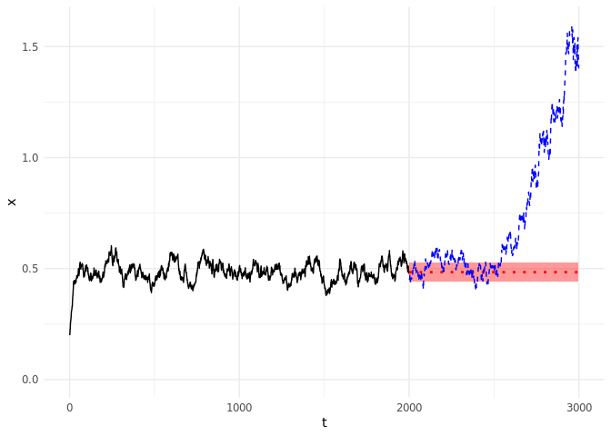
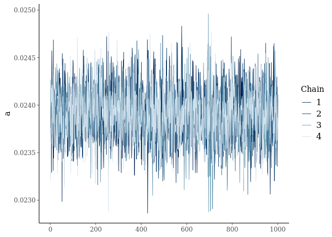
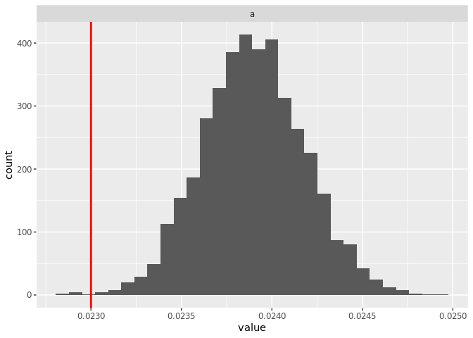

greta.Rmd
================
Carl Boettiger
5/30/2019

``` r
library(tidyverse)
library(greta) # remotes::install_github("greta-dev/greta")
set.seed(123456)
```

``` r
source("../R/ghost.R")
```

``` r
data <- vroom::vroom("../data/reps.csv.xz") %>% filter(t < 3000)
```

    ## Observations: 2,000,000
    ## Variables: 3
    ## dbl [3]: reps, t, x
    ## 
    ## Call `spec()` for a copy-pastable column specification
    ## Specify the column types with `col_types` to quiet this message

``` r
## get tail cases for comparison
ex <- data %>% group_by(reps) %>% summarise(ave = mean(x)) %>% arrange(ave)
lows <- ex %>% dplyr::slice(1:10) %>% pull(reps)
highs <- ex %>% dplyr::slice((n()-9):n()) %>% pull(reps)
```

``` r
library(stats)
x <- data %>% filter(reps == lows[[6]], t < 2000) %>% pull(x) %>% as.ts() 
fit <- arima(x)
y <- predict(fit, n.ahead = 1000) %>% as.data.frame()
y <- bind_rows(data.frame(pred = x, se = 0), y)
```

    ## Warning in bind_rows_(x, .id): Vectorizing 'ts' elements may not preserve
    ## their attributes
    
    ## Warning in bind_rows_(x, .id): Vectorizing 'ts' elements may not preserve
    ## their attributes
    
    ## Warning in bind_rows_(x, .id): Vectorizing 'ts' elements may not preserve
    ## their attributes

``` r
arima_forecast <- data %>% filter(reps == lows[[6]]) %>% select(t,x) %>% bind_cols(y)
```

``` r
train <- arima_forecast %>% filter(t < 2000) 
test <- arima_forecast %>% filter(t > 2000) 
train %>%
  ggplot(aes(t)) + 
  geom_line(aes(y=x)) +
  geom_line(aes(y=pred), lwd = 1, lty = 3, col = "red", data = test) + 
  geom_ribbon(aes(y=pred, ymin=pred-se, ymax=pred+se), alpha = 0.4, fill = "red", data = test)  + 
  geom_line(aes(y=x), data = test, lty = 2, col="blue") +
  xlim(0,3000) + ylim(0, 1.6)+ ylab("x") + theme_minimal()
```

<!-- -->

``` r
wide <- select(train, x) %>% as.matrix() 
n <- dim(wide)[1]
x_t1 <- wide[-1,]
x_t <- wide[-n,] 
```

``` r
r <- 0.05 
Q <- 5
K <- 2
# a <- 0.0233
H <- 0.38
sigma <- 0.02

# r <- uniform(0, 1)
# Q <- uniform(0, 10)
#K <- uniform(0, 10)
a <- uniform(0, 1)
# H <- uniform(0,  2)
#sigma <- uniform(0, 1)


# Model
mean <- x_t + r * x_t * (1 - x_t / K) - a * x_t ^ Q / (x_t ^ Q + H ^ Q)
distribution(x_t1) <- normal(mean, sigma * x_t)
m <- model(a)
```

``` r
system.time({
  draws <- mcmc(m, n_samples = 1000, warmup = 3000, chains = 4, verbose = FALSE)
})
```

    ##    user  system elapsed 
    ##  45.163   2.934  33.471

``` r
summary(draws)
```

    ## 
    ## Iterations = 1:1000
    ## Thinning interval = 1 
    ## Number of chains = 4 
    ## Sample size per chain = 1000 
    ## 
    ## 1. Empirical mean and standard deviation for each variable,
    ##    plus standard error of the mean:
    ## 
    ##           Mean             SD       Naive SE Time-series SE 
    ##      2.390e-02      2.824e-04      4.466e-06      4.680e-06 
    ## 
    ## 2. Quantiles for each variable:
    ## 
    ##    2.5%     25%     50%     75%   97.5% 
    ## 0.02336 0.02371 0.02389 0.02408 0.02446

``` r
bayesplot::mcmc_trace(draws)
```

<!-- -->

``` r
samples <-  
  map_dfr(draws, 
          function(x) data.frame(x, t = 1:dim(x)[1]), 
          .id = "chain") %>% 
  gather(variable, value, -t, -chain)
```

``` r
#Q = 5
true <- 
  data.frame(a = 0.023 #, 
             #r = .05, 
             #K = 2, 
             #H = .38, 
             #sigma = .02
             ) %>%
  gather(variable, value)
```

``` r
samples %>% ggplot() + 
  geom_histogram(aes(value), bins = 30)  +
  geom_vline(data = true, aes(xintercept = value), col = "red", lwd = 1) + 
  facet_wrap(~variable, scales = "free")
```

<!-- -->
