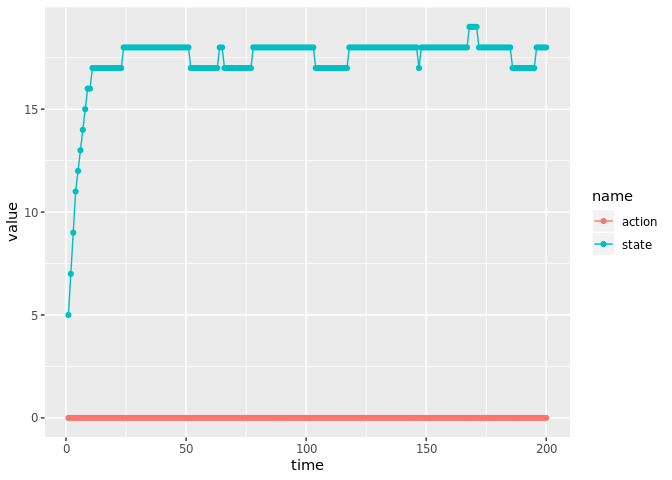
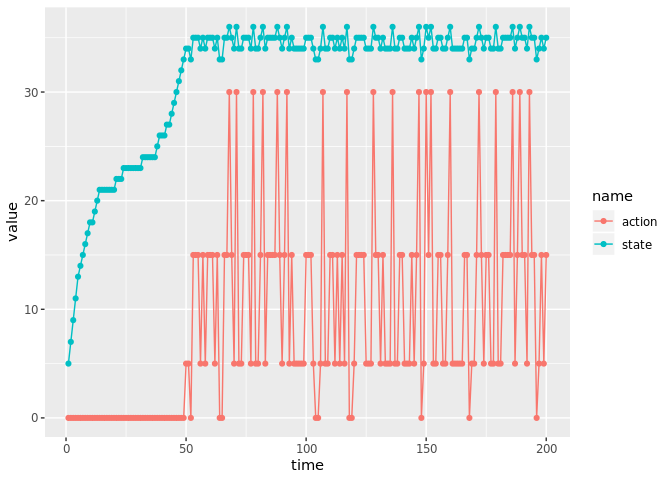
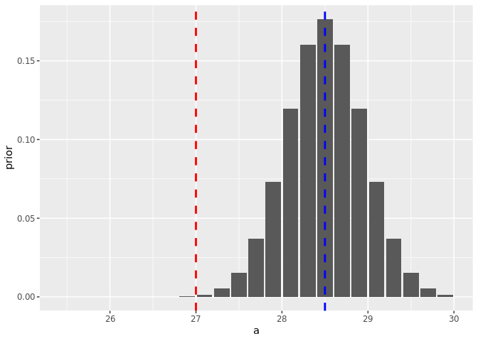

``` r
knitr::opts_chunk$set(warning=FALSE, message=FALSE)
library(tidyverse) 
library(MDPtoolbox)
library(mdplearning)
library(expm)
library(truncnorm)
```

# Outbreak model

  - ‘harvest’ term corresponds to removal of pest, with associated cost
  - also experience damage costs proportional to pest abundance

<!-- end list -->

``` r
#damage <- 0.3
#control <- 100
#discount <- 0.99

damage <- .5
control <- 1
endemic <- 50
discount <- 0.999 # Note that dynamics are not on scale of years but ~ days
e <- .4
n_s <- 121
states <- seq(0, 120, length = n_s)
actions <- seq(0, 120, length = n_s)

p <- list(r = .8, K = 153, q = 2, b = 20, sigma = .02, a=2.3, x0 = 20)

may <- function(a){  
  function(x, h = 0){ # May
    y <- x - e * h
    pmax(
      ## controlling h is controlling the bifurcation point directly...
      y + y * p$r * (1 - y / p$K)  - a * y ^ p$q / (y ^ p$q + p$b ^ p$q),  
      0)
  }
}

## safe state
## 

reward_fn <- function(x,h) - (damage * pmax(x - endemic, 0)) ^ 2  - (control * h)
# reward_fn <- function(x,h) - damage * (x / 100) ^ 2 - control * (h / 100) ^ 2
#

#reward_fn <- function(x,h) - damage * (x / max(states)) - control * h / max(actions) * x / max(states)
```

Range of possible a that covers tipping in both directions. Belief is in
a stable system while the reality is a transient (smaller `a`).

``` r
true_a <- 27      ### 21.5
believe_a <- 28.5 # 28.5   ### 22.5

possible_a <- seq(2*true_a - believe_a, 2*believe_a - true_a, by = 0.2)
true_i <- which.min(abs(possible_a - true_a))
```

``` r
## True a: The Ghost Attractor
names(possible_a) <- possible_a
df <- map_dfr(possible_a, 
        function(a){
          f <- may(a)
          tibble(x = states,
                 f = f(x,0) - x) 
        },
        .id = "a") %>% 
  mutate(group = a, 
         a = as.numeric(a))
        


df %>%
  ggplot(aes(x, f)) + 
    geom_point(aes(col = a), alpha = 0.8) + 
    geom_line(aes(lty = group), data = df %>% filter(a == true_a | a == believe_a), 
              lwd = 1, show.legend = FALSE) +
    geom_hline(aes(yintercept = 0)) + scale_color_viridis_c()
```

<!-- -->

``` r
transition_matrix <- function(states, actions, f, sigma){
    n_s <- length(states)
    n_a <- length(actions)
    transition <- array(0, dim = c(n_s, n_s, n_a))
    for(i in 1:n_a){
      for (k in 1:n_s) {
          nextpop <- f(states[k], actions[i])
          if (nextpop <= 0) {
          #if(which.min(abs(states - nextpop)) > 1) {
             x  <- c(1, rep(0, n_s - 1))
          } else {
            x <- truncnorm::dtruncnorm(states, 0, max(states), nextpop, sigma * nextpop)
            if(sum(x) <= 0){ 
              x  <- c(1, rep(0, n_s - 1))
            } else {
              x <- x / sum(x)
            }
          }
          transition[k, , i] <- x
      }
  }
  if(any(is.na(transition))) stop("error creating transition matrix")
    transition
}
```

``` r
m_true <- transition_matrix(states, actions, may(true_a), p$sigma)
m_belief <- transition_matrix(states, actions, may(believe_a), p$sigma)
```

``` r
X <- numeric(length(states))
X[2] <- 1

prob_dynamics <- function(M, X, Tmax){
  probability <- t(M) %^% Tmax %*% X 
  data.frame(state = states, probability)
}
  
Tmax <- 500
true_distrib <- prob_dynamics(m_true[,,2], X, Tmax)
believe_distrib <- prob_dynamics(m_belief[,,2], X, Tmax)
bind_rows(true = true_distrib, believe = believe_distrib, .id = "model") %>% 
  ggplot(aes(state,probability, col=model))  + geom_line(alpha=0.5) # + geom_bar(stat="identity")
```

<!-- -->

-----

# Planning

``` r
x0 <- which.min(abs(states - 5))
Tmax <- 200
```

``` r
reward <- array(dim=c(length(states), length(actions)))
for(i in 1:length(states)){
  for(j in 1:length(actions)){
    reward[i,j] <- reward_fn(states[i], actions[j])
  }
}
```

``` r
belief_p <- mdp_value_iteration(m_belief, reward, discount, epsilon = 1e-4)
```

    ## [1] "MDP Toolbox: iterations stopped, epsilon-optimal policy found"

``` r
true_p <- mdp_value_iteration(m_true, reward, discount, epsilon = 1e-5)
```

    ## [1] "MDP Toolbox: iterations stopped, epsilon-optimal policy found"

``` r
#soln <- mdplearning::mdp_compute_policy(list(m_belief), reward, discount)
#opt_soln <- mdplearning::mdp_compute_policy(list(m_true), reward, discount)
```

Policy based on the belief (i.e. that system is bi-stable)

``` r
tibble(state = states,
       belief = actions[belief_p$policy],
       ideal =  actions[true_p$policy]) %>%
  pivot_longer(c(belief, ideal), 
               names_to="model",
               values_to = "action") %>%
  ggplot(aes(state,action, color = model)) + geom_point(alpha=0.5) 
```

<!-- -->

Result experienced by incorrect belief: initial in-action followed by
need for continued maintenance to prevent high-level outbreak:

``` r
set.seed(12345)
df <- mdp_planning(m_true, reward, discount, model_prior = c(1), 
                   policy = belief_p$policy, x0 = x0, Tmax = Tmax)
```

``` r
df %>% 
  mutate(state = states[state], action = actions[action] * 5) %>% 
  select(-obs,-value) %>%
  pivot_longer(-time) %>%
  ggplot(aes(time, value, col=name)) + 
  geom_point() + geom_path() #+ 
```

<!-- -->

``` r
  #facet_wrap(~name, scales="free_y", ncol=1)
```

Expected result based on the belief: stable low level is acceptable, so
no action is required:

``` r
set.seed(12345)
df <- mdp_planning(m_belief, reward, discount, model_prior = c(1), 
                   policy = belief_p$policy, x0 = x0, Tmax = Tmax)

df %>% 
  mutate(state = states[state], action = actions[action] * 5) %>% 
  select(-obs,-value) %>%
  pivot_longer(-time) %>%
  ggplot(aes(time, value, col=name)) + 
  geom_point() + geom_path()
```

<!-- -->

Optimal strategy knowing this is just a transient (will depend on
discount rate):

``` r
df <- mdp_planning(m_true, reward, discount, model_prior = c(1), 
                   policy = true_p$policy, x0 = x0, Tmax = Tmax)

df %>% 
  mutate(state = states[state], action = actions[action] * 5) %>% 
  select(-obs,-value) %>%
  pivot_longer(-time) %>%
  ggplot(aes(time, value, col=name)) + 
  geom_point() + geom_path()
```

<!-- -->

-----

## Active Learning

``` r
models <- map(possible_a, function(a){
  f <- may(a)
 transition_matrix(states, actions, f, p$sigma)
})
```

``` r
transition <- models
```

## a near ghost

``` r
wd <- sd(possible_a)
prior <- dnorm(possible_a, believe_a, wd/3)
prior <- prior / sum(prior)
```

``` r
data.frame(a = possible_a, probability = prior) %>%
  ggplot(aes(a,prior)) + geom_bar(stat="identity") +
  geom_vline(aes(xintercept = true_a), col="red", lwd=1, lty=2) + 
  geom_vline(aes(xintercept = believe_a), col="blue", lwd=1, lty=2) 
```

<!-- -->

``` r
set.seed(12345)
Tmax_learning <- 50
mdp_learning_ <- memoise::memoise(mdp_learning)
  learning_sim <- mdp_learning_(transition, reward, discount, 
                      x0 = x0, 
                      Tmax = Tmax_learning, 
                      true_transition = transition[[true_i]],
                      model_prior = prior,
                      type = "value iteration", 
                      epsilon = 1e-2)
```

``` r
saveRDS(learning_sim, "learning_sim.rds")
```

``` r
 learning_sim$df %>% 
  select(-value) %>% 
  gather(series, state, -time) %>% 
  ggplot(aes(time, states[state], color = series)) + geom_line()
```

<!-- -->

``` r
 learning_sim$posterior %>% 
  data.frame(time = 1:Tmax_learning) %>%
  filter(time %in% seq(1,Tmax_learning, by = 5)) %>%
  gather(param, probability, -time, factor_key =TRUE) %>% 
  mutate(param = possible_a[as.integer(param)]) %>% 
  ggplot(aes(param, probability, group = time, alpha = time)) + 
  geom_line()
```

<!-- -->

-----

# Simulations for Gretas

“simulate” without any actions

``` r
x0 <- which.min(abs(states - p$x0))
Tmax <- 200
```

``` r
## `actions` is an argument of indices, not necessarily the action values themselves 
sim <- function (transition,  x0, Tmax, action = rep(1, Tmax)){
    n_states <- dim(transition)[2]
    state <- numeric(Tmax + 1)
    state[1] <- x0
    time <- 1:Tmax
    for (t in time) {
        state[t + 1] <- base::sample(1:n_states, 
                               1, 
                               prob = transition[state[t], , action[t]])
    }
    data.frame(time = 1:Tmax, state = state[time])
}
```

``` r
set.seed(12346)
no_switches <- sim(m_true, x0, Tmax)  %>% 
  mutate(state = states[state])

no_switches %>% 
  ggplot(aes(time, state)) + geom_point() + geom_path() 
```

<!-- -->

``` r
set.seed(12345)
switches <- sim(m_true, x0, Tmax) %>% mutate(state = states[state])

switches  %>% 
  ggplot(aes(time, state)) + geom_point() + geom_path() 
```

<!-- -->

``` r
set.seed(1234)
stable <- sim(m_belief, x0, Tmax)  %>% 
  mutate(state = states[state])

stable %>% 
  ggplot(aes(time, state)) + geom_point() + geom_path() 
```

<!-- -->

``` r
## Collect the data sets.  Use names.
examples <- bind_rows(switches = switches, 
                      no_switches = no_switches, 
                      stable = stable, 
                      .id="series") 
```

# Greta

``` r
library(greta)
```

``` r
estimate_posterior <- function(df){
  X <- df$state
  # Reshape time-series data into ordered pairs
  n <- length(X)
  x_t1 <- X[-1]
  x_t <- X[-n] 
  
  # Prior
  a <- uniform(min(possible_a), max(possible_a))
  
  # Model definition
  mean <- x_t + p$r * x_t * (1 - x_t / p$K) - a * x_t ^ p$q / (x_t ^ p$q + p$b ^ p$q)
  distribution(x_t1) <- normal(mean, p$sigma * x_t)
  m <- model(a)

  # MCMC
  system.time({
    draws <- mcmc(m, n_samples = 1000, warmup = 3000, chains = 4, verbose = FALSE)
  })
  
  
  ## tidy
  samples <-  
    map_dfr(draws, function(x) data.frame(x, t = 1:dim(x)[1]), .id = "chain") %>% 
    gather(variable, value, -t, -chain)
}
```

``` r
samples <- examples %>% 
  group_by(series) %>% 
  group_modify(~estimate_posterior(.x))
```

``` r
true <- tribble(~ value, ~ a,
                believe_a, "attractor",
                believe_a,  "attractor",
                true_a,     "ghost")

samples %>% 
  ggplot() + 
  geom_histogram(aes(value, fill=series), stat="density", alpha = 0.8) + 
  geom_vline(data = true, aes(xintercept = value, lty=a), col="black", lwd = 1) + 
  facet_wrap(~variable, scales = "free")
```

<!-- -->
