``` r
knitr::opts_chunk$set(fig.width = 7)
```

``` r
library(MDPtoolbox)
library(mdplearning)
library(expm)
library(truncnorm)
library(tidyverse) 
```

# Outbreak model

  - ‘harvest’ term corresponds to removal of pest, with associated cost
  - also experience damage costs proportional to pest abundance

<!-- end list -->

``` r
damage <- 0.05
control <- 1
#reward_fn <- function(x,h) - damage * x ^ 2 - control * h
#discount <- 0.98

n_s <- 200
states <- seq(0,2, length=n_s)

sigma_g <- 0.05
r <- 0.8
K <- 1.53
q <- 2
b <- .2
eps <- states[2]/10

may <- function(a){  
  function(x, h = 0){ # May
    # x <- pmax(x - h, 0)   # harvest then recruit   
    x + x * r * (1 - x / K)  - a * x ^ q / (x ^ q + b ^ q) + eps - h
  }
}
```

Range of possible a that covers tipping in both directions:

``` r
possible_a <- seq(.25, .34, by = 0.005)
true_a <- 0.27   ## reality has just a transient.  use  0.277 for stronger ghost
## 0.28: technically 'ghost' is an attractor but effectively not
believe_a <- 0.28 ## believe there's an attractor
true_i <- which.min(abs(possible_a - true_a))
```

``` r
f <- may(true_a)
tibble(x = states[1:120],
       f = f(x,0) - x) %>%
  ggplot(aes(x, f)) + geom_line() +
  geom_point() +  geom_hline(aes(yintercept = 0))
```

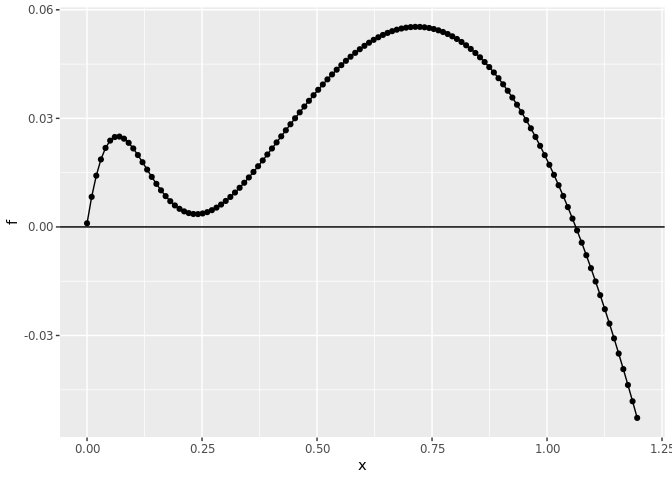<!-- -->

``` r
f <- may(believe_a)
tibble(x = states[1:120],
       f = f(x,0) - x) %>%
  ggplot(aes(x, f)) + geom_line() +
  geom_point() +  geom_hline(aes(yintercept = 0))
```

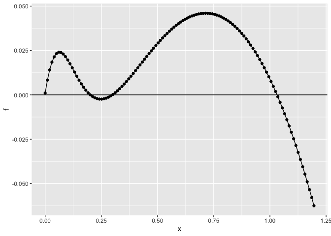<!-- -->

``` r
transition_matrix <- function(states, f, sigma){
    n_s <- length(states)
    transition <- array(0, dim = c(n_s, n_s))
    for (k in 1:n_s) {
        
            nextpop <- f(states[k])
            if (nextpop <= 0) {
                transition[, k] <- c(1, rep(0, n_s - 1))
            }
            else {
              x <- truncnorm::dtruncnorm(states, 0, max(states), nextpop, sigma * nextpop)
              transition[, k] <- x / sum(x)
                  
            }
            
    }
    transition
}
```

``` r
m_true <- transition_matrix(states, may(true_a), sigma_g)
m_belief <- transition_matrix(states, may(believe_a), sigma_g)
```

“simulate” without any actions

``` r
x0 <- which.min(abs(states - 0.1))
Tmax <- 300
```

``` r
X <- numeric(length(states))
X[x0] <- 1

prob_dynamics <- function(M, X, Tmax){
  probability <- M %^% Tmax %*% X 
  data.frame(state = states, probability)
}
  
prob_dynamics(m_belief, X, Tmax) %>% 
  ggplot(aes(state,probability))  + geom_point() # + geom_bar(stat="identity")
```

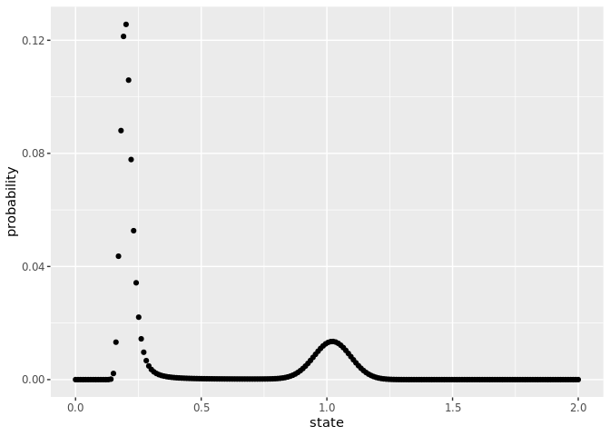<!-- -->

``` r
sim <- function (transition,  x0, Tmax ){
    n_states <- dim(transition)[2]
    state <- numeric(Tmax + 1)
    state[1] <- x0
    time <- 1:Tmax
    for (t in time) {
        state[t + 1] <- base::sample(1:n_states, 
                               1, 
                               prob = transition[, state[t]])
    }
    data.frame(time = 1:Tmax, state = state[time])
}
```

``` r
set.seed(12345)
no_switches <- sim(m_belief, x0, Tmax)  %>% 
  mutate(state = states[state])

no_switches %>% 
  ggplot(aes(time, state)) + geom_point() + geom_path() 
```

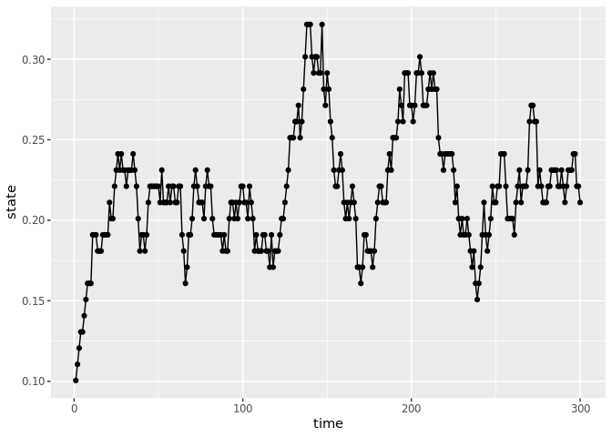<!-- -->

``` r
set.seed(11)
switches <- sim(m_belief, x0, Tmax) %>% mutate(state = states[state])

switches  %>% 
  ggplot(aes(time, state)) + geom_point() + geom_path() 
```

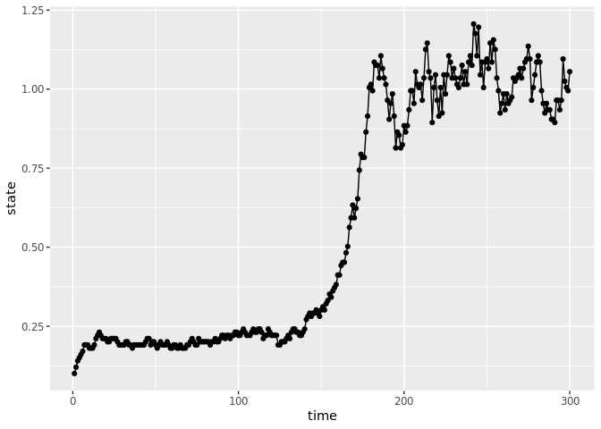<!-- -->

-----

# Greta

Vectorize data

``` r
X <- switches$state
n <- length(X)
x_t1 <- X[-1]
x_t <- X[-n] 
```

``` r
library(greta)
```

    ## 
    ## Attaching package: 'greta'

    ## The following object is masked _by_ '.GlobalEnv':
    ## 
    ##     f

    ## The following object is masked from 'package:dplyr':
    ## 
    ##     slice

    ## The following objects are masked from 'package:Matrix':
    ## 
    ##     chol2inv, colMeans, colSums, cov2cor, diag, rowMeans, rowSums

    ## The following objects are masked from 'package:stats':
    ## 
    ##     binomial, cov2cor, poisson

    ## The following objects are masked from 'package:base':
    ## 
    ##     %*%, apply, backsolve, beta, chol2inv, colMeans, colSums,
    ##     diag, eigen, forwardsolve, gamma, identity, rowMeans, rowSums,
    ##     sweep, tapply

``` r
#a <- uniform(0, 1)
a <- uniform(.25, .34)
wd <- 0.0005 # binwidth for plots
```

``` r
mean <- x_t + r * x_t * (1 - x_t / K) - a * x_t ^ q / (x_t ^ q + b ^ q)
distribution(x_t1) <- normal(mean, sigma_g * x_t)
m <- model(a)
```

``` r
system.time({
  draws <- mcmc(m, n_samples = 1000, warmup = 3000, chains = 4, verbose = FALSE)
})
```

    ##    user  system elapsed 
    ##  47.344   2.501  34.512

``` r
bayesplot::mcmc_trace(draws)
```

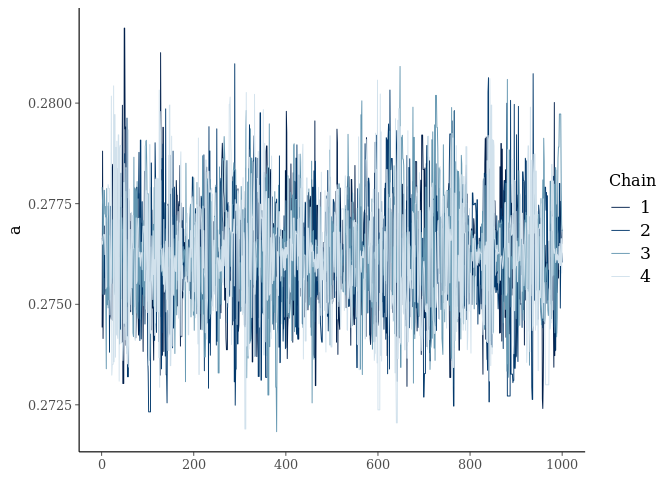<!-- -->

``` r
samples <-  
  map_dfr(draws, function(x) data.frame(x, t = 1:dim(x)[1]), .id = "chain") %>% 
  gather(variable, value, -t, -chain)


true <- data.frame(a = believe_a)  %>% gather(variable, value)

samples %>% ggplot() + 
  geom_histogram(aes(value), binwidth = wd)  +
  geom_vline(data = true, aes(xintercept = value), col = "red", lwd = 1) + 
  facet_wrap(~variable, scales = "free")
```

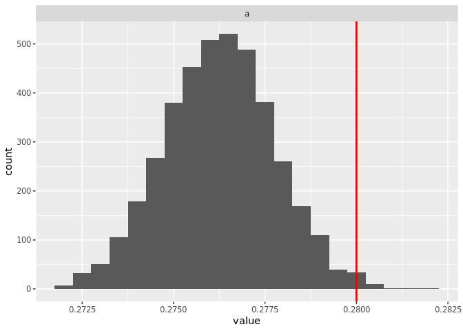<!-- -->

-----

``` r
X <- no_switches$state
n <- length(X)
x_t1 <- X[-1]
x_t <- X[-n] 
```

``` r
a <- uniform(.25, .34)
mean <- x_t + r * x_t * (1 - x_t / K) - a * x_t ^ q / (x_t ^ q + b ^ q)
distribution(x_t1) <- normal(mean, sigma_g * x_t)
m <- model(a)
```

``` r
system.time({
  draws <- mcmc(m, n_samples = 1000, warmup = 3000, chains = 4, verbose = FALSE)
})
```

    ##    user  system elapsed 
    ##  46.375   2.109  33.235

``` r
bayesplot::mcmc_trace(draws)
```

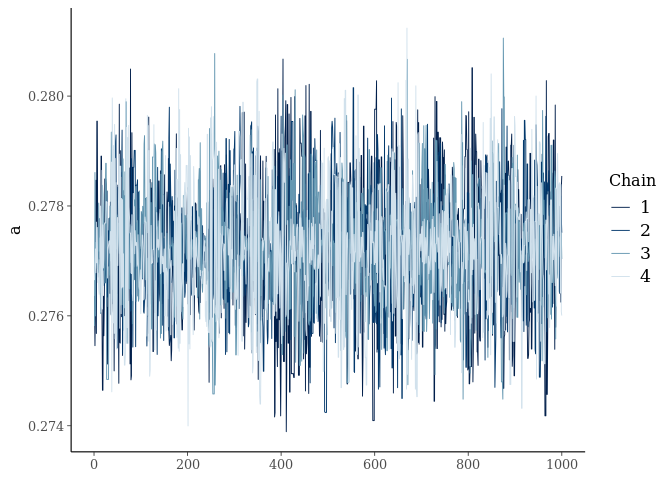<!-- -->

``` r
samples <-  
  map_dfr(draws, 
          function(x) data.frame(x, t = 1:dim(x)[1]), 
          .id = "chain") %>% 
  gather(variable, value, -t, -chain)

samples %>% ggplot() + 
  geom_histogram(aes(value), binwidth = wd)  +
  geom_vline(data = true, aes(xintercept = value), col = "red", lwd = 1) + 
  facet_wrap(~variable, scales = "free")
```

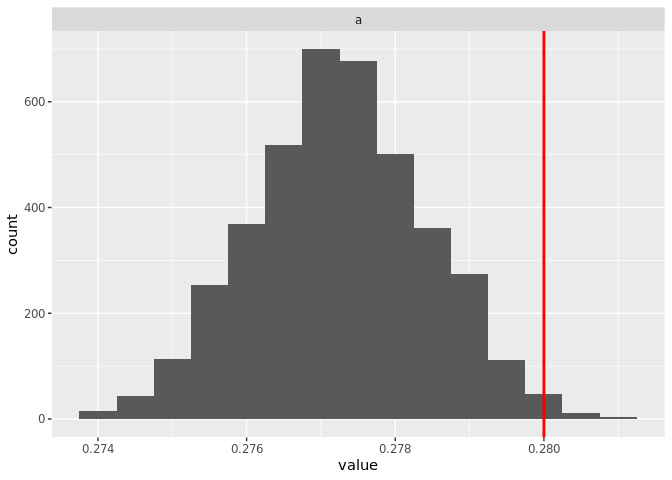<!-- -->

``` r
set.seed(12345)
weak_ghost <- sim(m_true, x0, Tmax)  %>% 
  mutate(state = states[state])

weak_ghost %>% 
  ggplot(aes(time, state)) + geom_point() + geom_path() 
```

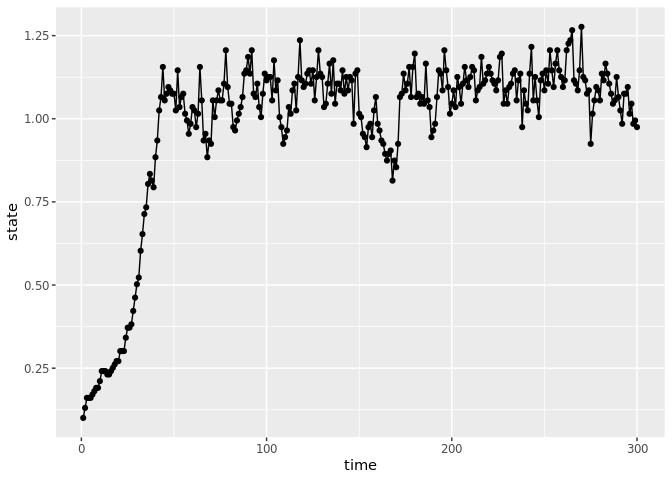<!-- -->

Vectorize data

``` r
X <- weak_ghost$state
n <- length(X)
x_t1 <- X[-1]
x_t <- X[-n] 
```

``` r
#a <- uniform(.25, .34)
a <- uniform(0, 1)
```

``` r
mean <- x_t + r * x_t * (1 - x_t / K) - a * x_t ^ q / (x_t ^ q + b ^ q)
distribution(x_t1) <- normal(mean, sigma_g * x_t)
m <- model(a)
```

``` r
system.time({
  draws <- mcmc(m, n_samples = 1000, warmup = 3000, chains = 4, verbose = FALSE)
})
```

    ##    user  system elapsed 
    ##  45.428   2.098  32.580

``` r
bayesplot::mcmc_trace(draws)
```

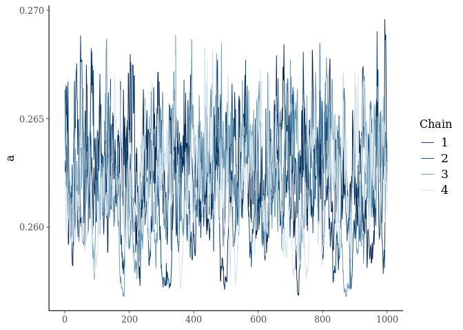<!-- -->

``` r
samples <-  
  map_dfr(draws, function(x) data.frame(x, t = 1:dim(x)[1]), .id = "chain") %>% 
  gather(variable, value, -t, -chain)


true <- data.frame(a = true_a)  %>% gather(variable, value)

samples %>% ggplot() + 
  geom_histogram(aes(value), binwidth = wd)  +
  geom_vline(data = true, aes(xintercept = value), col = "red", lwd = 1) + 
  facet_wrap(~variable, scales = "free")
```

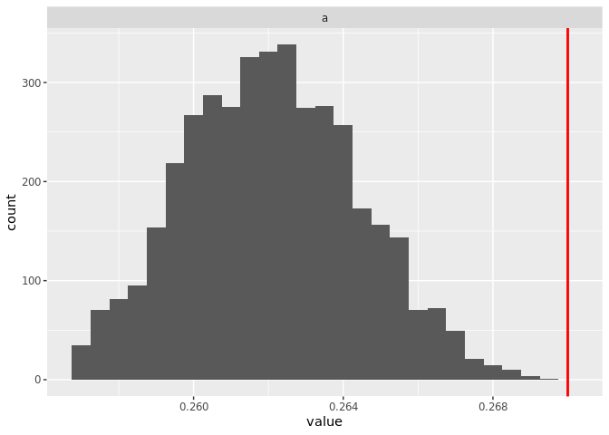<!-- -->
