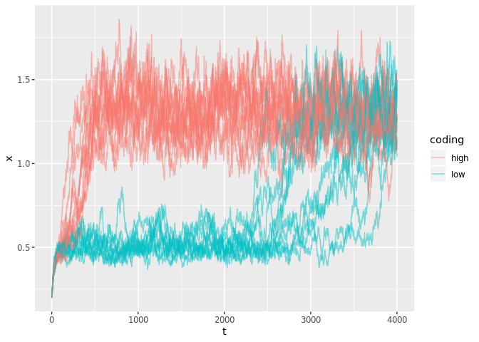
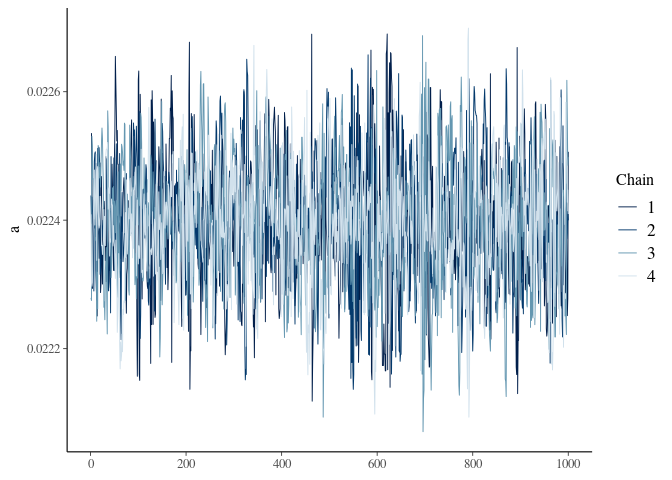
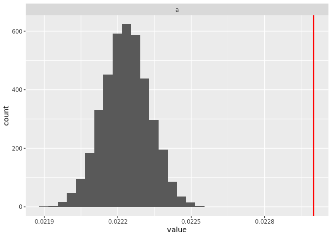
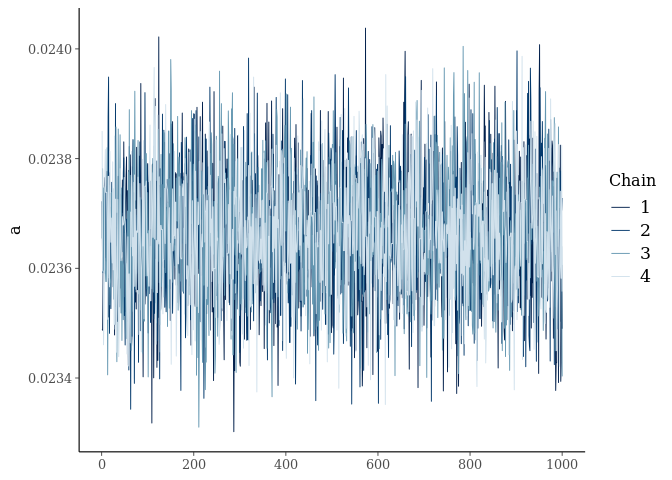
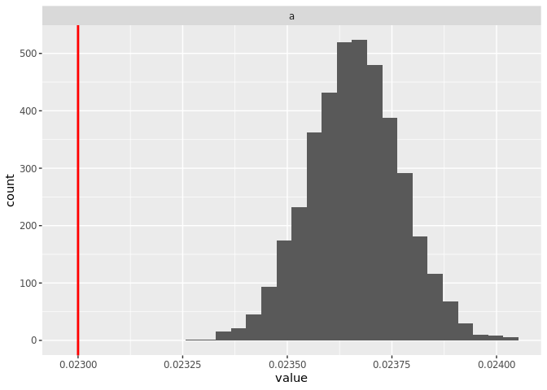
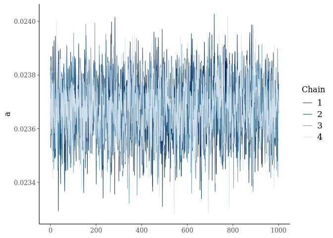
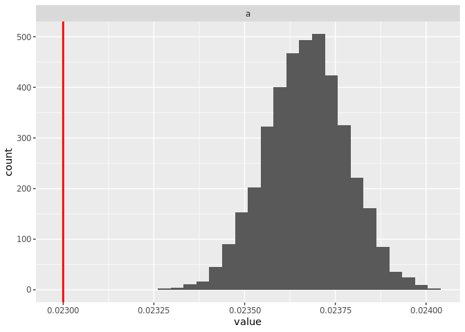
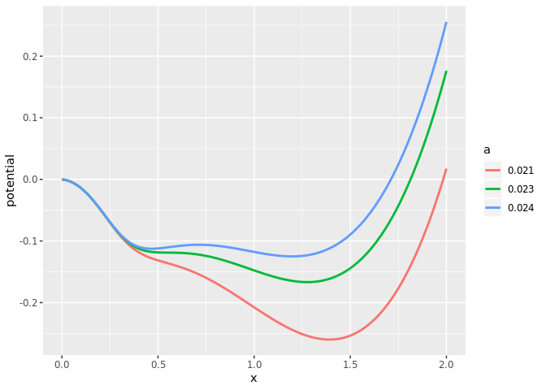

greta.Rmd
================
Carl Boettiger
5/30/2019

``` r
library(tidyverse)
library(greta) # remotes::install_github("greta-dev/greta")
set.seed(123456)
```

``` r
data <- read_csv("../data/reps.csv.xz") # %>% filter(t %in% seq(0,4000, by=4))
```

    ## Parsed with column specification:
    ## cols(
    ##   reps = col_double(),
    ##   t = col_double(),
    ##   x = col_double()
    ## )

``` r
data %>% ggplot(aes(t,x, group=reps)) + geom_line(alpha=0.02)
```

<!-- -->

Divide this data into several groups based
on

``` r
means <- data %>% group_by(reps) %>% summarise(ave = mean(x)) %>% arrange(ave)

lows <- means %>% dplyr::slice(1:10) %>% pull(reps)
highs <- means %>% dplyr::slice((n()-10):n()) %>% pull(reps)
coding <- function(reps) case_when(
  reps %in% lows ~ "low",
  reps %in% highs ~ "high"
)
extremes <- data %>% mutate(coding = coding(reps)) %>% na.omit()

write_csv(extremes, "../data/extremes.csv.xz")
extremes %>% ggplot(aes(t, x, group=reps, color = coding)) + geom_line(alpha=0.5)
```

<!-- -->

``` r
#means %>% ggplot(aes(ave)) + geom_histogram(binwidth = 0.02)
```

## highs

``` r
wide <- data %>% 
  filter(reps %in% highs) %>%
  spread(reps, x) %>%
  select(-t) %>% 
  as.matrix()
n <- dim(wide)[1]
```

``` r
x_t1 <- wide[-1,]
x_t <- wide[-n,] 
```

``` r
r <- 0.05 
Q <- 5
K <- 2
# a <- 0.0233
H <- 0.38
sigma <- 0.02

# r <- uniform(0, 1)
# Q <- uniform(0, 10)
#K <- uniform(0, 10)
a <- uniform(0, 1)
# H <- uniform(0,  2)
#sigma <- uniform(0, 1)


# Model
mean <- x_t + r * x_t * (1 - x_t / K) - a * x_t ^ Q / (x_t ^ Q + H ^ Q)
distribution(x_t1) <- normal(mean, sigma * x_t)
m <- model(a)
```

``` r
system.time({
  draws <- mcmc(m, n_samples = 1000, warmup = 3000, chains = 4, verbose = FALSE)
})
```

    ##    user  system elapsed 
    ##  46.822   4.490  36.598

``` r
summary(draws)
```

    ## 
    ## Iterations = 1:1000
    ## Thinning interval = 1 
    ## Number of chains = 4 
    ## Sample size per chain = 1000 
    ## 
    ## 1. Empirical mean and standard deviation for each variable,
    ##    plus standard error of the mean:
    ## 
    ##           Mean             SD       Naive SE Time-series SE 
    ##      2.219e-02      1.058e-04      1.672e-06      2.411e-06 
    ## 
    ## 2. Quantiles for each variable:
    ## 
    ##    2.5%     25%     50%     75%   97.5% 
    ## 0.02198 0.02212 0.02219 0.02226 0.02240

``` r
bayesplot::mcmc_trace(draws)
```

<!-- -->

``` r
samples <-  
  map_dfr(draws, 
          function(x) data.frame(x, t = 1:dim(x)[1]), 
          .id = "chain") %>% 
  gather(variable, value, -t, -chain)
```

``` r
#Q = 5
true <- 
  data.frame(a = 0.023 #, 
             #r = .05, 
             #K = 2, 
             #H = .38, 
             #sigma = .02
             ) %>%
  gather(variable, value)
```

``` r
samples %>% ggplot() + 
  geom_histogram(aes(value), bins = 30)  +
  geom_vline(data = true, aes(xintercept = value), col = "red", lwd = 1) + 
  facet_wrap(~variable, scales = "free")
```

<!-- -->

-----

## lows

``` r
wide <- data %>% 
  filter(reps %in% lows) %>%
  spread(reps, x) %>%
  select(-t) %>% 
  as.matrix()
n <- dim(wide)[1]
```

``` r
x_t1 <- wide[-1,]
x_t <- wide[-n,] 
```

``` r
a <- uniform(0, 1)
mean <- x_t + r * x_t * (1 - x_t / K) - a * x_t ^ Q / (x_t ^ Q + H ^ Q)
distribution(x_t1) <- normal(mean, sigma * x_t)
m <- model(a)
```

``` r
system.time({
  draws2 <- mcmc(m, n_samples = 1000, warmup = 3000, chains = 4, verbose = FALSE)
})
```

    ##    user  system elapsed 
    ##  49.161   4.668  38.348

``` r
bayesplot::mcmc_trace(draws2)
```

<!-- -->

``` r
samples2 <-  
  map_dfr(draws2, 
          function(x) data.frame(x, t = 1:dim(x)[1]), 
          .id = "chain") %>% 
  gather(variable, value, -t, -chain)

samples2 %>% ggplot() + 
  geom_histogram(aes(value), bins = 30)  +
  geom_vline(data = true, aes(xintercept = value), col = "red", lwd = 1) + 
  facet_wrap(~variable, scales = "free")
```

<!-- -->

## Full ensemble

``` r
wide <- data %>% 
  spread(reps, x) %>%
  select(-t) %>% 
  as.matrix()
n <- dim(wide)[1]
```

``` r
x_t1 <- wide[-1,]
x_t <- wide[-n,] 
```

``` r
a <- uniform(0, 1)
mean <- x_t + r * x_t * (1 - x_t / K) - a * x_t ^ Q / (x_t ^ Q + H ^ Q)
distribution(x_t1) <- normal(mean, sigma * x_t)
m <- model(a)
```

``` r
system.time({
  draws3 <- mcmc(m, n_samples = 1000, warmup = 3000, chains = 6, verbose = FALSE)
})
```

    ##    user  system elapsed 
    ## 434.969 288.289 713.648

``` r
bayesplot::mcmc_trace(draws3)
```

<!-- -->

``` r
samples3 <-  
  map_dfr(draws3, 
          function(x) data.frame(x, t = 1:dim(x)[1]), 
          .id = "chain") %>% 
  gather(variable, value, -t, -chain)

samples3 %>% ggplot() + 
  geom_histogram(aes(value), bins = 30)  +
  geom_vline(data = true, aes(xintercept = value), col = "red", lwd = 1) + 
  facet_wrap(~variable, scales = "free")
```

<!-- -->

``` r
p <- list(r = .05, K = 2, Q = 5, H = .38, sigma = .02, a=0.023, N = 4e3, x0 = 0.2, N = 1e4)
source("../R/ghost.R")
p$a <- 0.021
tf <- theory(p) %>% mutate(a = 0.021)

p$a <- 0.023
tf <- theory(p) %>% mutate(a = 0.023) %>% bind_rows(tf)

p$a <- 0.024
tf <- theory(p) %>% mutate(a = 0.024) %>% bind_rows(tf)

tf <- tf %>% mutate(a = as.factor(a))
 
tf %>%
  ggplot(aes(x, potential, col=a)) +
  geom_line(lwd=1)
```

<!-- -->
