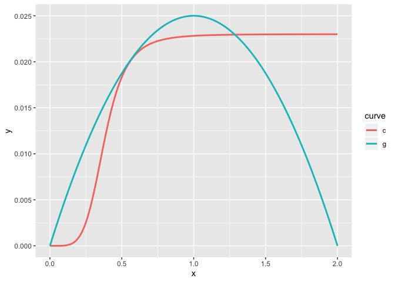
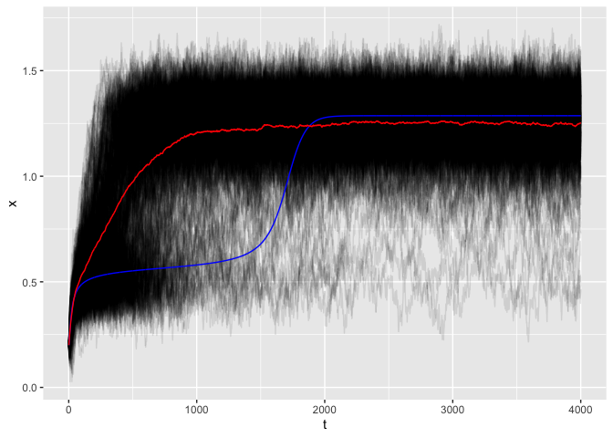

simulation & inference of transients
================
Carl Boettiger
5/30/2019

``` r
library(tidyverse)
library(furrr)
library(nimble)
```

``` r
p <- list(r = .05, K = 2, Q = 5, H = .38, sigma = .02, a=0.023, N = 4e3, x0 = 0.2)
growth <- function(x, p) x * p$r * (1 - x / p$K)
consumption <- function(x, p) p$a * x ^ p$Q / (x^p$Q + p$H^p$Q)
```

``` r
theory <- 
  tibble(x= seq(0,2, length.out = 100)) %>%
  mutate(g = growth(x,p), 
         c = consumption(x,p)) %>%
  mutate(potential = - cumsum(g - c)) %>%
  gather(curve, y, -x, -potential) 
```

``` r
theory %>%
  ggplot(aes(x, y, col=curve)) +
  geom_line(lwd=1)
```

<!-- -->

``` r
theory %>%
  ggplot(aes(x, potential)) + 
  geom_line(lwd=1)
```

<!-- -->

``` r
may <- function(x, p) x + growth(x,p) - consumption(x,p)
#x + x * p$r * (1 - x / p$K)  - p$a * x ^ p$Q / (x ^ p$Q + p$H ^ p$Q)

stochastic_sim <- function(f, p){
  x <- numeric(p$N)
  x[1] <- p$x0
  dBt <- rnorm(p$N, 0, p$sigma)
  for(t in 1:(p$N-1)){
    x[t+1] <- max( 
                  f(x[t], p) + dBt[t],
                  0)
  }
  data.frame(t = 1:p$N, x)
}

det_sim <- function(f, p){
  x <- numeric(p$N)
  x[1] <- p$x0
  for(t in 1:(p$N-1)){
    x[t+1] <- f(x[t], p)
  }
  data.frame(t = 1:p$N, x)
}
```

``` r
plan("multisession")
system.time({
  df <- future_map_dfr(1:500, function(reps) stochastic_sim(may, p), .id = "reps")
})
```

    ##    user  system elapsed 
    ##   1.309   0.193  27.663

``` r
det <- det_sim(may,p) %>% mutate(reps=1)
mean <- df %>% group_by(t) %>% summarise(x = mean(x)) %>% mutate(reps = 1)
```

``` r
df %>% ggplot(aes(t, x, group=reps)) + 
  geom_line(alpha=0.1) +
  geom_line(data = det, color = "blue") + 
  geom_line(data = mean, color = "red")
```

<!-- -->

``` r
#df %>% write_csv("../data/reps.csv")
```
