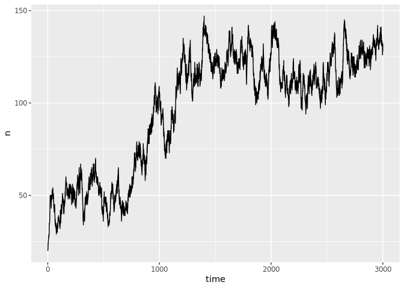
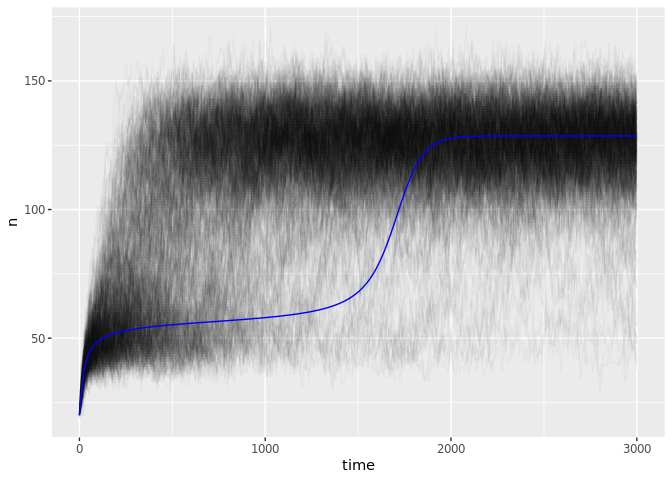

``` r
library(tidyverse)
```

    ## ── Attaching packages ───────────────────────────────────────────────────────────────── tidyverse 1.2.1 ──

    ## ✔ ggplot2 3.2.1     ✔ purrr   0.3.2
    ## ✔ tibble  2.1.3     ✔ dplyr   0.8.3
    ## ✔ tidyr   1.0.0     ✔ stringr 1.4.0
    ## ✔ readr   1.3.1     ✔ forcats 0.4.0

    ## ── Conflicts ──────────────────────────────────────────────────────────────────── tidyverse_conflicts() ──
    ## ✖ dplyr::filter() masks stats::filter()
    ## ✖ dplyr::lag()    masks stats::lag()

``` r
library(furrr)
```

    ## Loading required package: future

``` r
library(adaptivetau)
```

``` r
set.seed(1234) # set random number generator seed to be reproducible

p <- list(
  r = .05,
  K = 200,
  Q = 5,
  H = 38,
  a = 2.3,
  x0 = 20,
  Tmax = 3000
)

transitions = list(c(n = +1), # birth event
                   c(n = -1)) # death event
growth <- function(x, p)
  x * p$r * (1 - x / p$K)
consumption <- function(x, p)
  p$a * x ^ p$Q / (x ^ p$Q + p$H ^ p$Q)

rates <- function(state, params, t) {
  c(growth(state[["n"]], params),
    consumption(state[["n"]], params)
   )
}
```

Run simulation

``` r
gillespie <- function(reps) adaptivetau::ssa.exact(
      init.values = c(n = p$x0),
      transitions,
      rates,
      params = p,
      tf = p$Tmax
    ) %>% as_tibble()
```

Test a single replicate:

``` r
sim <- gillespie(1)
sim %>% ggplot(aes(time, n)) + geom_path()
```

<!-- -->

## Stochastic replicates

``` r
plan("multisession")
df <- future_map_dfr(1:500, gillespie, .id = "reps")
```

Deterministic sim

``` r
dt <- 0.01
x <- numeric(p$Tmax/dt)
x[1] <- p$x0
for(t in 1:(p$Tmax/dt-1)){
    x[t+1] <- (growth(x[t], p) - consumption(x[t], p)) * dt + x[t]
}
det <- tibble(time = seq(dt,p$Tmax,by=dt), n = x, reps = 1)
```

``` r
## Stochastic means -- nope, not sampled evenly
## mean <- df %>% group_by(t) %>% summarise(x = mean(x)) %>% mutate(reps = 1)
```

<!-- Re-sample df at uniform intervals! -->

``` r
df %>% 
  group_by(reps) %>% sample_n(1000) %>%
  ggplot(aes(time, n, group=reps)) +
  geom_line(alpha=0.03) +
  geom_line(data = sample_n(det,1000), col="blue")
```

<!-- -->

``` r
#write_csv(df, "data/gillespie.csv.xz")
```
