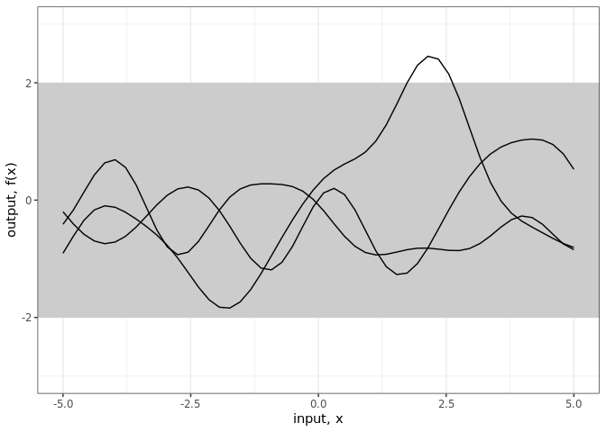
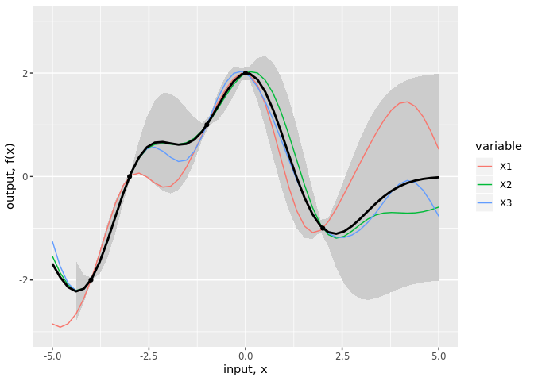
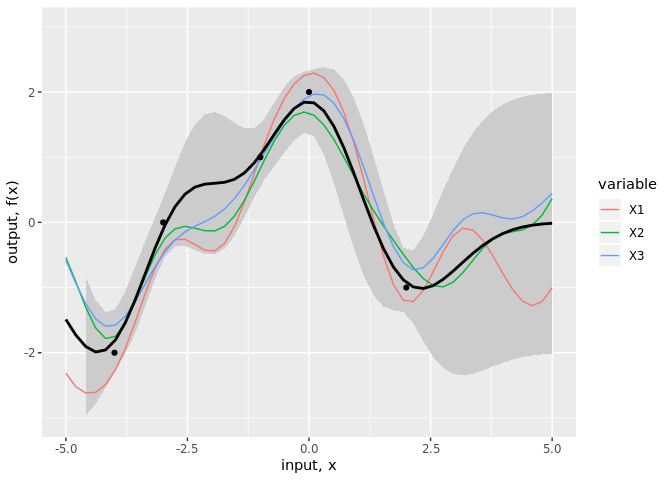

Basic regression in Gaussian processes
================

``` r
library(tidyverse)
```

    ## ── Attaching packages ─────────────────────────────────────────────────────────────────── tidyverse 1.2.1 ──

    ## ✔ ggplot2 3.2.1     ✔ purrr   0.3.3
    ## ✔ tibble  2.1.3     ✔ dplyr   0.8.3
    ## ✔ tidyr   1.0.0     ✔ stringr 1.4.0
    ## ✔ readr   1.3.1     ✔ forcats 0.4.0

    ## ── Conflicts ────────────────────────────────────────────────────────────────────── tidyverse_conflicts() ──
    ## ✖ dplyr::filter() masks stats::filter()
    ## ✖ dplyr::lag()    masks stats::lag()

``` r
library(greta)
```

    ## 
    ## Attaching package: 'greta'

    ## The following object is masked from 'package:dplyr':
    ## 
    ##     slice

    ## The following objects are masked from 'package:stats':
    ## 
    ##     binomial, cov2cor, poisson

    ## The following objects are masked from 'package:base':
    ## 
    ##     %*%, apply, backsolve, beta, chol2inv, colMeans, colSums,
    ##     diag, eigen, forwardsolve, gamma, identity, rowMeans, rowSums,
    ##     sweep, tapply

``` r
library(greta.gp)

require(MASS)
```

    ## Loading required package: MASS

    ## 
    ## Attaching package: 'MASS'

    ## The following object is masked from 'package:dplyr':
    ## 
    ##     select

``` r
require(reshape2)
```

    ## Loading required package: reshape2

    ## 
    ## Attaching package: 'reshape2'

    ## The following object is masked from 'package:tidyr':
    ## 
    ##     smiths

``` r
require(ggplot2)
set.seed(12345)
```

``` r
x_predict <- seq(-5,5,len=50)
l <- 1
```

We will use the squared exponential (also called radial basis or
Gaussian, though it is not this that gives Gaussian process it’s name;
any covariance function would do) as the covariance
function,

\[\operatorname{cov}(X_i, X_j) = \exp\left(-\frac{(X_i - X_j)^2}{2 \ell ^ 2}\right)\]

``` r
SE <- function(Xi,Xj, l) exp(-0.5 * (Xi - Xj) ^ 2 / l ^ 2)
cov <- function(X, Y) outer(X, Y, SE, l)
```

``` r
COV <- cov(x_predict, x_predict)
```

Generate (draw) a number of functions from the process

``` r
values <- mvrnorm(3, rep(0, length=length(x_predict)), COV)
```

Reshape the data into long (tidy) form, listing x value, y value, and
sample number

``` r
dat <- data.frame(x=x_predict, t(values))
dat <- melt(dat, id="x")

fig2a <- ggplot(dat,aes(x=x,y=value)) +
  geom_rect(xmin=-Inf, xmax=Inf, ymin=-2, ymax=2, fill="grey80") +
  geom_line(aes(group=variable))  +
  scale_y_continuous(lim=c(-3,3), name="output, f(x)") +
  xlab("input, x") +
  theme_bw()
fig2a
```

<!-- -->

### Posterior distribution given the data

Imagine we have some data,

``` r
obs <- data.frame(x = c(-4, -3, -1,  0,  2),
                  y = c(-2,  0,  1,  2, -1))
```

In general we aren’t interested in drawing from the prior, but want to
include information from the data as well. We want the joint
distribution of the observed values and the prior
is:

\[\begin{pmatrix} y_{\textrm{obs}} \\ y_{\textrm{pred}} \end{pmatrix} \sim \mathcal{N}\left( \mathbf{0}, \begin{bmatrix} cov(X_o,X_o) & cov(X_o, X_p) \\ cov(X_p,X_o) & cov(X_p, X_p) \end{bmatrix} \right)\]

## No observation noise

Assuming the data are known without error and conditioning on the data,
and given \(x \sim \mathcal{N}(0, cov(X_o, X_o))\), then the conditional
probability of observing our data is easily solved by exploiting the
nice properties of Gaussians,

\[x|y \sim \mathcal{N}\left(E,C\right)\]
\[E = cov(X_p, X_o) cov(X_o,X_o)^{-1} y\]
\[C= cov(X_p, X_p) - cov(X_p, X_o) cov(X_o,X_o)^{-1} cov(X_o, X_p) \]

(We use `solve(M)` which with no second argument will simply invert the
matrix `M`, but should use the Cholsky decomposition instead for better
numerical stability)

``` r
cov_xx_inv <- solve(cov(obs$x, obs$x))
Ef <- cov(x_predict, obs$x) %*% cov_xx_inv %*% obs$y
Cf <- cov(x_predict, x_predict) - cov(x_predict, obs$x)  %*% cov_xx_inv %*% cov(obs$x, x_predict)
```

Now lets take 3 random samples from the posterior distribution,

``` r
values <- mvrnorm(3, Ef, Cf)
```

and plot our solution (mean, 2 standard deviations, and the ranom
samples.)

``` r
dat <- data.frame(x=x_predict, t(values))
dat <- melt(dat, id="x")


gp <- data.frame(x = x_predict, Ef = Ef, sigma = 2*sqrt(diag(Cf)) )

ggplot(dat,aes(x=x,y=value)) + 
  geom_ribbon(data = gp, 
              aes(x, 
                  y = Ef, 
                  ymin = Ef - sigma, 
                  ymax = Ef + sigma
              ),
              fill="grey80") +
  geom_line(aes(color=variable)) + #REPLICATES
  geom_line(dat = gp, aes(x=x,y=Ef), size=1) + #MEAN
  geom_point(data=obs,aes(x=x,y=y)) +  #OBSERVED DATA
  scale_y_continuous(lim=c(-3,3), name="output, f(x)") +
  xlab("input, x")
```

    ## Warning: Ignoring unknown aesthetics: y

<!-- -->


## Additive noise

In general the model may have process error, and rather than observe the
deterministic map \(f(x)\) we only observe \(y = f(x) + \varepsilon\).
Let us assume for the moment that \(\varepsilon\) are independent,
normally distributed random variables with variance \(\sigma_n^2\).

``` r
sigma.n <- 0.25
cov_xx_inv <- solve(cov(obs$x, obs$x) + sigma.n^2 * diag(1, length(obs$x)))
Ef <- cov(x_predict, obs$x) %*% cov_xx_inv %*% obs$y
Cf <- cov(x_predict, x_predict) - cov(x_predict, obs$x)  %*% cov_xx_inv %*% cov(obs$x, x_predict)
```

Now lets take 3 random samples from the posterior distribution,

``` r
values <- mvrnorm(3, Ef, Cf)
```

and plot

``` r
dat <- data.frame(x=x_predict, t(values))
dat <- melt(dat, id="x")

gp <- data.frame(x_predict = x_predict, Ef = Ef, sigma = 2*sqrt(diag(Cf)) )


fig2c <- ggplot(dat,aes(x=x,y=value)) +
  geom_ribbon(data=gp, 
              aes(x=x_predict, y=Ef, ymin=Ef-sigma, ymax=Ef+sigma),
              fill="grey80") + # Var
  geom_line(aes(color=variable)) + #REPLICATES
  geom_line(data=gp,aes(x=x_predict,y=Ef), size=1) + #MEAN
  geom_point(data=obs,aes(x=x,y=y)) +  #OBSERVED DATA
  scale_y_continuous(lim=c(-3,3), name="output, f(x)") +
  xlab("input, x")
```

    ## Warning: Ignoring unknown aesthetics: y

``` r
fig2c
```

<!-- -->

Note that unlike the previous case, the posterior no longer collapses
completely around the neighborhood of the test points.
