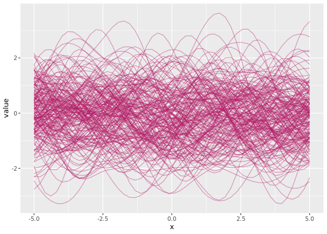
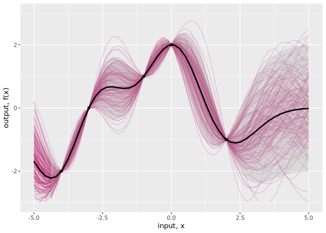
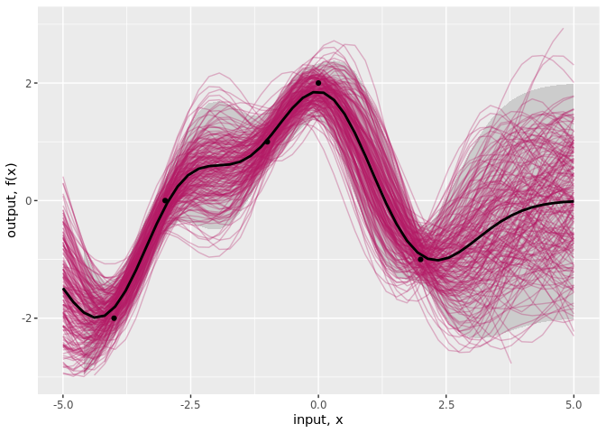
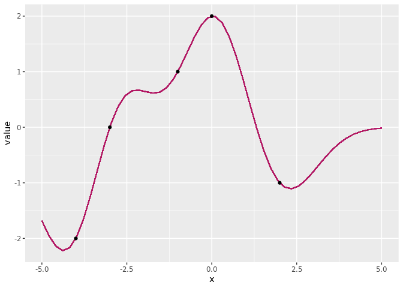
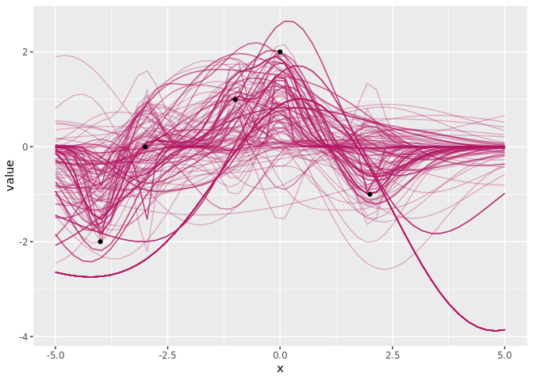

Basic regression in Gaussian processes
================

First I take a look at doing some simple tasks involving Gaussian
processes in base R and sample from them with basic multi-variate normal
random draw, `mvrnorm`. Then, I speculate (unsuccessfully) on how to do
this in greta.

``` r
library(MASS)
library(tidyverse)

knitr::opts_chunk$set(message=FALSE, warning=FALSE)


set.seed(12345)
```

``` r
x_predict <- seq(-5,5,len=50)
l <- 1
```

We will use the squared exponential (also called radial basis or
Gaussian, though it is not this that gives Gaussian process it’s name;
any covariance function would do) as the covariance
function,

\[\operatorname{cov}(X_i, X_j) = \exp\left(-\frac{(X_i - X_j)^2}{2 \ell ^ 2}\right)\]

``` r
SE <- function(Xi,Xj, l) exp(-0.5 * (Xi - Xj) ^ 2 / l ^ 2)
cov <- function(X, Y) outer(X, Y, SE, l)
```

``` r
COV <- cov(x_predict, x_predict)
```

Generate (draw) a number of functions from the process (note that this
is not conditioned on any data, and we are leaving the hyperparameter
`l` fixed)

``` r
values <- mvrnorm(200, rep(0, length=length(x_predict)), COV)
```

Reshape the data into long (tidy) form, listing x value, y value, and
sample number

``` r
dat <- data.frame(x=x_predict, t(values)) %>%
  tidyr::pivot_longer(-x, names_to = "rep", values_to = "value") %>% 
  mutate(rep = as.numeric(as.factor(rep)))

ggplot(dat,aes(x=x,y=value)) +
  geom_line(aes(group=rep), color =  rgb(0.7, 0.1, 0.4), alpha = 0.4) 
```

<!-- -->

### Posterior distribution conditional on data

Imagine we have some data,

``` r
obs <- data.frame(x = c(-4, -3, -1,  0,  2),
                  y = c(-2,  0,  1,  2, -1))
```

In general we aren’t interested in drawing from the prior, but want to
include information from the data as well. We want the joint
distribution of the observed values and the prior
is:

\[\begin{pmatrix} y_{\textrm{obs}} \\ y_{\textrm{pred}} \end{pmatrix} \sim \mathcal{N}\left( \mathbf{0}, \begin{bmatrix} cov(X_o,X_o) & cov(X_o, X_p) \\ cov(X_p,X_o) & cov(X_p, X_p) \end{bmatrix} \right)\]

## No observation noise

Assuming the data are known without error and conditioning on the data,
and given \(x \sim \mathcal{N}(0, cov(X_o, X_o))\), then the conditional
probability of observing our data is easily solved by exploiting the
nice properties of Gaussians,

\[x|y \sim \mathcal{N}\left(E,C\right)\]
\[E = cov(X_p, X_o) cov(X_o,X_o)^{-1} y\]
\[C= cov(X_p, X_p) - cov(X_p, X_o) cov(X_o,X_o)^{-1} cov(X_o, X_p) \]

(We use `solve(M)` which with no second argument will simply invert the
matrix `M`, but should use the Cholsky decomposition instead for better
numerical stability)

``` r
cov_xx_inv <- solve(cov(obs$x, obs$x))
Ef <- cov(x_predict, obs$x) %*% cov_xx_inv %*% obs$y
Cf <- cov(x_predict, x_predict) - cov(x_predict, obs$x)  %*% cov_xx_inv %*% cov(obs$x, x_predict)
```

Now lets take 3 random samples from the posterior distribution,

``` r
values <- mvrnorm(200, Ef, Cf)
```

and plot our solution (mean in black, 2 standard deviations in grey
riboon, and the 200 random samples in purple.)

``` r
dat <- data.frame(x=x_predict, t(values)) %>%
  tidyr::pivot_longer(-x, names_to = "rep", values_to = "value") %>% 
  mutate(rep = as.numeric(as.factor(rep)))


gp <- data.frame(x = x_predict, Ef = Ef, sigma = 2*sqrt(diag(Cf)) )

ggplot(dat,aes(x=x,y=value)) + 
  geom_line(aes(group=rep), color =  rgb(0.7, 0.1, 0.4), alpha = 0.2) + #REPLICATES
  geom_ribbon(data = gp, 
              aes(x, 
                  y = Ef, 
                  ymin = Ef - sigma, 
                  ymax = Ef + sigma),
              fill="grey", alpha = 0.4) +
  geom_line(dat = gp, aes(x=x,y=Ef), size=1) + #MEAN
  geom_point(data=obs,aes(x=x,y=y)) +  #OBSERVED DATA
  scale_y_continuous(lim=c(-3,3), name="output, f(x)") +
  xlab("input, x")
```

<!-- -->

## Additive noise

In general the model may have process error, and rather than observe the
deterministic map \(f(x)\) we only observe \(y = f(x) + \varepsilon\).
Let us assume for the moment that \(\varepsilon\) are independent,
normally distributed random variables with variance \(\sigma_n^2\).

``` r
sigma.n <- 0.25
cov_xx_inv <- solve(cov(obs$x, obs$x) + sigma.n^2 * diag(1, length(obs$x)))
Ef <- cov(x_predict, obs$x) %*% cov_xx_inv %*% obs$y
Cf <- cov(x_predict, x_predict) - cov(x_predict, obs$x)  %*% cov_xx_inv %*% cov(obs$x, x_predict)
```

Now lets take 3 random samples from the posterior distribution,

``` r
values <- mvrnorm(200, Ef, Cf)
```

and plot (both sample curves, in purple, and the theoretical expected
variance as a grey ribbon)

``` r
dat <- data.frame(x=x_predict, t(values))
dat <- reshape2::melt(dat, id="x")

gp <- data.frame(x_predict = x_predict, Ef = Ef, sigma = 2*sqrt(diag(Cf)) )


ggplot(dat,aes(x=x,y=value)) +
  geom_ribbon(data=gp, 
              aes(x=x_predict, y=Ef, ymin=Ef-sigma, ymax=Ef+sigma),
              fill="grey80") + # Var
  geom_line(aes(group=variable), alpha=0.3, col=rgb(0.7, 0.1, 0.4, 0.1)) + #REPLICATES
  geom_line(data=gp,aes(x=x_predict,y=Ef), size=1) + #MEAN
  geom_point(data=obs,aes(x=x,y=y)) +  #OBSERVED DATA
  scale_y_continuous(lim=c(-3,3), name="output, f(x)") +
  xlab("input, x")
```

<!-- -->

-----

# greta

Can we express the same operations in greta?

``` r
library(tidyverse)
library(greta)
library(greta.gp)
```

# Try greta with fixed parameters

Here I try to replicate the above results under ‘no additive noise’ by
setting the noise term to (almost) zero. (trying `obs_sd = 0` causes the
MCMC to fail to find initial values)

``` r
# kernel & GP
y <- obs$y
x <- obs$x

# hyperparameters
rbf_var <- 1
rbf_len <- 1
obs_sd <- 0.001

# kernel & GP
kernel <- rbf(rbf_len, rbf_var)
f <- gp(x, kernel)

# likelihood -- not clear how this influences f_plot?
distribution(y)<- normal(f, obs_sd)

# prediction
f_plot <- project(f, x_predict)
```

``` r
# fit the model by Hamiltonian Monte Carlo
m <- model(f_plot)
draws <- mcmc(m, chains = 1, one_by_one = TRUE)
```

Unfortunately, instead of causing the GP to collapse down only at the
data points, like in the example above, this cause the GP samples to
collapse entirely:

``` r
draws[[1]] %>% t() %>% as_tibble() %>% dplyr::select(1:200) %>% 
  mutate(x = x_predict) %>% pivot_longer(-x)  %>%
  ggplot(aes(x,value)) + 
  geom_line(aes(group=name), alpha=0.3, col=rgb(0.7, 0.1, 0.4, 0.1)) +
  geom_point(data = obs, aes(x,y))
```

<!-- -->

# MCMC with greta

``` r
# kernel & GP
y <- obs$y
x <- obs$x

# hyperparameters
rbf_var <- lognormal(0, 1)
rbf_len <- lognormal(0, 1)
obs_sd <- lognormal(0, 1)

# kernel & GP
kernel <- rbf(rbf_len, rbf_var)
f <- gp(x, kernel)

# likelihood -- not clear how this influences f_plot?
distribution(y)<- normal(f, obs_sd)

# prediction
f_plot <- project(f, x_predict)
```

``` r
# fit the model by Hamiltonian Monte Carlo
m <- model(f_plot, rbf_len, rbf_var, obs_sd)
draws <- mcmc(m, chains = 1, one_by_one = TRUE)
```

``` r
df <- draws[[1]] %>% as_tibble(.name_repair = "universal") 
hyperpars <- df %>% dplyr::select(rbf_len, obs_sd, rbf_var)  
posterior <- df %>% dplyr::select(-rbf_len, -obs_sd, -rbf_var)    

hyperpars %>% colMeans()
```

    ##  rbf_len   obs_sd  rbf_var 
    ## 1.084206 1.200977 1.562875

``` r
#hyperpars %>% gather() %>% ggplot(aes(x = value, fill=key)) + stat_density() + facet_wrap(~key)
```

``` r
posterior %>% t() %>% as_tibble() %>% dplyr::select(1:200) %>% mutate(x = x_predict) %>% pivot_longer(-x)  %>%
  ggplot(aes(x,value)) + 
  geom_line(aes(group=name), alpha=0.3, col=rgb(0.7, 0.1, 0.4, 0.1)) +
  geom_point(data = obs, aes(x,y))
```

<!-- -->
