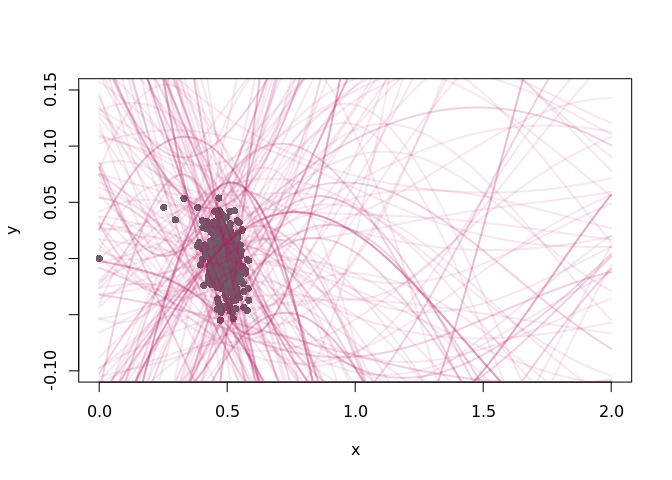

``` r
library(tidyverse)
```

    ## ── Attaching packages ─────────────────────────────────────────────────────────────────── tidyverse 1.2.1 ──

    ## ✔ ggplot2 3.2.1     ✔ purrr   0.3.3
    ## ✔ tibble  2.1.3     ✔ dplyr   0.8.3
    ## ✔ tidyr   1.0.0     ✔ stringr 1.4.0
    ## ✔ readr   1.3.1     ✔ forcats 0.4.0

    ## ── Conflicts ────────────────────────────────────────────────────────────────────── tidyverse_conflicts() ──
    ## ✖ dplyr::filter() masks stats::filter()
    ## ✖ dplyr::lag()    masks stats::lag()

``` r
library(greta)
```

    ## 
    ## Attaching package: 'greta'

    ## The following object is masked from 'package:dplyr':
    ## 
    ##     slice

    ## The following objects are masked from 'package:stats':
    ## 
    ##     binomial, cov2cor, poisson

    ## The following objects are masked from 'package:base':
    ## 
    ##     %*%, apply, backsolve, beta, chol2inv, colMeans, colSums,
    ##     diag, eigen, forwardsolve, gamma, identity, rowMeans, rowSums,
    ##     sweep, tapply

``` r
library(greta.gp)
#tensorflow::use_session_with_seed(1234)
```

``` r
arima_forecast <- readr::read_csv("../data/arima_forecast.csv.gz")
```

    ## Parsed with column specification:
    ## cols(
    ##   t = col_double(),
    ##   x = col_double(),
    ##   pred = col_double(),
    ##   se = col_double()
    ## )

``` r
train <- arima_forecast  %>% filter(t %in% seq(0, 2000, by = 5))

wide <- select(train, x) %>% as.matrix() 
n <- dim(wide)[1]
x_t1 <- wide[-1,]
x_t <- wide[-n,] 


y <- c(0,x_t1 - x_t)
x <- c(0, x_t)
x_plot <- seq(0, 2, length.out = 200)
```

``` r
# simulate toy data
#x <- runif(20, 0, 10)
#y <- sin(x) + rnorm(20, 0, 0.5)
#x_plot <- seq(-1, 11, length.out = 200)
```

``` r
# hyperparameters
rbf_var <- lognormal(0, 1)
rbf_len <- lognormal(0, .01)
obs_sd <- lognormal(0, .01)

# kernel & GP
kernel <- rbf(rbf_len, rbf_var) + bias(1)
f <- gp(x, kernel)

# likelihood
distribution(y) <- normal(f, obs_sd)

# prediction
f_plot <- project(f, x_plot)
```

``` r
# fit the model by Hamiltonian Monte Carlo
m <- model(f_plot)
draws <- mcmc(m, one_by_one = TRUE)
```

    ## 
    ## running 4 chains simultaneously on up to 24 cores

    ## 
        warmup                                           0/1000 | eta:  ?s          
        warmup ==                                       50/1000 | eta:  4m | 2% bad 
        warmup ====                                    100/1000 | eta:  3m | 1% bad 
        warmup ======                                  150/1000 | eta:  3m | <1% bad
        warmup ========                                200/1000 | eta:  2m | <1% bad
        warmup ==========                              250/1000 | eta:  2m | <1% bad
        warmup ===========                             300/1000 | eta:  2m | <1% bad
        warmup =============                           350/1000 | eta:  2m | <1% bad
        warmup ===============                         400/1000 | eta:  2m | <1% bad
        warmup =================                       450/1000 | eta:  2m | <1% bad
        warmup ===================                     500/1000 | eta:  2m | <1% bad
        warmup =====================                   550/1000 | eta:  1m | <1% bad
        warmup =======================                 600/1000 | eta:  1m | <1% bad
        warmup =========================               650/1000 | eta:  1m | <1% bad
        warmup ===========================             700/1000 | eta:  1m | <1% bad
        warmup ============================            750/1000 | eta: 45s | <1% bad
        warmup ==============================          800/1000 | eta: 36s | <1% bad
        warmup ================================        850/1000 | eta: 27s | <1% bad
        warmup ==================================      900/1000 | eta: 18s | <1% bad
        warmup ====================================    950/1000 | eta:  9s | <1% bad
        warmup ====================================== 1000/1000 | eta:  0s | <1% bad
    ## 
      sampling                                           0/1000 | eta:  ?s          
      sampling ==                                       50/1000 | eta:  3m          
      sampling ====                                    100/1000 | eta:  3m          
      sampling ======                                  150/1000 | eta:  2m          
      sampling ========                                200/1000 | eta:  2m          
      sampling ==========                              250/1000 | eta:  2m          
      sampling ===========                             300/1000 | eta:  2m          
      sampling =============                           350/1000 | eta:  2m          
      sampling ===============                         400/1000 | eta:  2m          
      sampling =================                       450/1000 | eta:  2m          
      sampling ===================                     500/1000 | eta:  1m          
      sampling =====================                   550/1000 | eta:  1m          
      sampling =======================                 600/1000 | eta:  1m          
      sampling =========================               650/1000 | eta:  1m          
      sampling ===========================             700/1000 | eta:  1m          
      sampling ============================            750/1000 | eta: 44s          
      sampling ==============================          800/1000 | eta: 35s          
      sampling ================================        850/1000 | eta: 26s          
      sampling ==================================      900/1000 | eta: 18s          
      sampling ====================================    950/1000 | eta:  9s          
      sampling ====================================== 1000/1000 | eta:  0s

``` r
# plot 200 posterior samples
#plot(y ~ x, pch = 16, col = grey(0.4), xlim = c(0, 10), ylim = c(-2.5, 2.5))


plot(y ~ x, pch = 16, col = grey(0.4), xlim = c(0, 2), ylim = c(-0.1, 0.15))
for (i in 1:200) {
  lines(draws[[1]][i, ] ~ x_plot,
        lwd = 2,
        col = rgb(0.7, 0.1, 0.4, 0.1))  
}
```

<!-- -->
