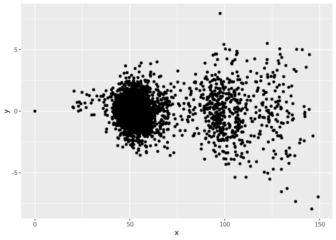

``` r
library(greta)
```

    ## 
    ## Attaching package: 'greta'

    ## The following objects are masked from 'package:stats':
    ## 
    ##     binomial, cov2cor, poisson

    ## The following objects are masked from 'package:base':
    ## 
    ##     %*%, apply, backsolve, beta, chol2inv, colMeans, colSums,
    ##     diag, eigen, forwardsolve, gamma, identity, rowMeans, rowSums,
    ##     sweep, tapply

``` r
library(greta.gp)
#tensorflow::use_session_with_seed(1234)
library(tidyverse)
```

    ## ── Attaching packages ─────────────────────────────────────────────────────────────────────────────────────────────────────── tidyverse 1.2.1 ──

    ## ✔ ggplot2 3.2.1     ✔ purrr   0.3.3
    ## ✔ tibble  2.1.3     ✔ dplyr   0.8.3
    ## ✔ tidyr   1.0.0     ✔ stringr 1.4.0
    ## ✔ readr   1.3.1     ✔ forcats 0.4.0

    ## ── Conflicts ────────────────────────────────────────────────────────────────────────────────────────────────────────── tidyverse_conflicts() ──
    ## ✖ dplyr::filter() masks stats::filter()
    ## ✖ dplyr::lag()    masks stats::lag()
    ## ✖ dplyr::slice()  masks greta::slice()

## Model Definition

``` r
p <- list(r = .05, K = 200, Q = 5, H = 38, sigma = .002, a=2.3, N = 3e3, x0 = 6)
```

``` r
growth <- function(x, p) x * p$r * (1 - x / p$K)
consumption <- function(x, p) p$a * x ^ p$Q / (x^p$Q + p$H^p$Q)
may <- function(x, p) x + growth(x,p) - consumption(x,p)
```

## Model simulations

``` r
# Generic simulator routine
sim <- function(f, p){
  x <- numeric(p$N)
  x[1] <- p$x0
  dBt <- numeric(p$N)
  if(p$sigma > 0) dBt <- rnorm(p$N, 0, p$sigma)
  for(t in 1:(p$N-1)){
    x[t+1] <- max(f(x[t], p) + x[t] * dBt[t], 0)
  }
  data.frame(t = 1:p$N, x)
}
```

Deterministic simulations:

``` r
p_det <- p
p_det$sigma <- 0
det <- sim(may,p_det) 
det_diffs <- det %>% mutate(y = lead(x)-x, case = "det")
det_diffs <- det %>% mutate(y = c(diff(x),NA), case = "det")

ex <- sim(may,p) 
ex %>% mutate(y = lead(x)-x, case = "stoch")  %>% bind_rows(det_diffs) %>%
  ggplot(aes(x,y, col=case)) + geom_point()
```

    ## Warning: Removed 2 rows containing missing values (geom_point).

<!-- -->

``` r
ghost <- readr::read_csv("../data/ghost_sims.csv.gz")
wide <- ghost %>% dplyr::select(-t) %>% pivot_wider(names_from = reps, values_from = x) 
n <- dim(wide)[1]
x_t1 <- wide[-1,]
x_t <- wide[-n,] 
y <- x_t1 - x_t
Y <- y %>% apply(1, mean, na.rm=TRUE)
X <- x_t %>% apply(1, mean, na.rm=TRUE)

tibble(x=X,y=Y, case="mean") %>% bind_rows(det_diffs) %>% ggplot(aes(x,y, col=case)) + geom_point()

ghost %>% group_by(reps) %>%  mutate(y = lead(x)-x) %>% 
  ggplot(aes(x,y)) + geom_point(size=.1, alpha=0.005)
```

``` r
arima_forecast <- readr::read_csv("../data/arima_forecast.csv.gz")
```

    ## Parsed with column specification:
    ## cols(
    ##   t = col_double(),
    ##   x = col_double(),
    ##   pred = col_double(),
    ##   se = col_double()
    ## )

``` r
train <- arima_forecast  #%>% filter(t %in% seq(0, 2000, by = 5))

wide <- select(train, x) %>% as.matrix() 
n <- dim(wide)[1]
x_t1 <- wide[-1,]
x_t <- wide[-n,] 


y <- c(0,x_t1 - x_t)
x <- c(0, x_t)
x_predict <- seq(0, 2, length.out = 200)

tibble(x,y) %>% ggplot(aes(x,y)) + geom_point()
```

<!-- -->

-----

``` r
# kernel & GP
y <- diff(ex$x)
x <- ex$x[-n]
obs <- data.frame(x,y)
ggplot(obs, aes(x,y)) + geom_point()
```

<!-- -->

``` r
# hyperparameters
rbf_var <- lognormal(0, 1)
rbf_len <- lognormal(0, 10)
obs_sd <- lognormal(0, .1)

# kernel & GP
kernel <- rbf(rbf_len, rbf_var)
f <- gp(x, kernel)

# likelihood -- not clear how this influences f_plot?
distribution(y)<- normal(f, obs_sd)

# prediction
x_predict <- seq(0, 150, len=200)
f_plot <- project(f, x_predict)
```

``` r
# fit the model by Hamiltonian Monte Carlo over hyperparameters only, not sampling from the GP
m <- model(rbf_len, rbf_var, obs_sd)
draws <- mcmc(m, chains = 1, one_by_one = TRUE)
```

    ## 
        warmup                                           0/1000 | eta:  ?s          
        warmup ==                                       50/1000 | eta:  2h          
        warmup ====                                    100/1000 | eta:  2h          
        warmup ======                                  150/1000 | eta:  1h          
        warmup ========                                200/1000 | eta:  1h          
        warmup ==========                              250/1000 | eta:  1h          
        warmup ===========                             300/1000 | eta:  1h          
        warmup =============                           350/1000 | eta:  1h          
        warmup ===============                         400/1000 | eta:  1h          
        warmup =================                       450/1000 | eta:  1h | 2% bad 
        warmup ===================                     500/1000 | eta:  1h | 2% bad 
        warmup =====================                   550/1000 | eta: 46m | 1% bad 
        warmup =======================                 600/1000 | eta: 41m | 1% bad 
        warmup =========================               650/1000 | eta: 36m | 1% bad 
        warmup ===========================             700/1000 | eta: 31m | 1% bad 
        warmup ============================            750/1000 | eta: 26m | 1% bad 
        warmup ==============================          800/1000 | eta: 21m | 1% bad 
        warmup ================================        850/1000 | eta: 15m | <1% bad
        warmup ==================================      900/1000 | eta: 10m | <1% bad
        warmup ====================================    950/1000 | eta:  5m | <1% bad
        warmup ====================================== 1000/1000 | eta:  0s | <1% bad
    ## 
      sampling                                           0/1000 | eta:  ?s          
      sampling ==                                       50/1000 | eta:  2h          
      sampling ====                                    100/1000 | eta:  2h          
      sampling ======                                  150/1000 | eta:  1h          
      sampling ========                                200/1000 | eta:  1h          
      sampling ==========                              250/1000 | eta:  1h          
      sampling ===========                             300/1000 | eta:  1h          
      sampling =============                           350/1000 | eta:  1h          
      sampling ===============                         400/1000 | eta:  1h          
      sampling =================                       450/1000 | eta:  1h          
      sampling ===================                     500/1000 | eta:  1h          
      sampling =====================                   550/1000 | eta: 46m          
      sampling =======================                 600/1000 | eta: 41m          
      sampling =========================               650/1000 | eta: 36m          
      sampling ===========================             700/1000 | eta: 31m          
      sampling ============================            750/1000 | eta: 26m          
      sampling ==============================          800/1000 | eta: 21m          
      sampling ================================        850/1000 | eta: 15m          
      sampling ==================================      900/1000 | eta: 10m          
      sampling ====================================    950/1000 | eta:  5m          
      sampling ====================================== 1000/1000 | eta:  0s

``` r
df <- draws[[1]] %>% as_tibble(.name_repair = "universal") 
```

    ## Warning: Calling `as_tibble()` on a vector is discouraged, because the behavior is likely to change in the future. Use `tibble::enframe(name = NULL)` instead.
    ## This warning is displayed once per session.

``` r
readr::write_csv(df, "draws.csv.gz")
hyperpars <- df %>% dplyr::select(rbf_len, obs_sd, rbf_var)
posterior_means <- hyperpars %>% colMeans()
posterior_means
```

    ##    rbf_len     obs_sd    rbf_var 
    ## 19.5056337  0.2076883  0.3527297

``` r
hyperpars %>% gather() %>% ggplot(aes(x = value, fill=key)) + stat_density() + facet_wrap(~key)
```

<!-- -->

``` r
cov <- kernel
sigma.n <- posterior_means["obs_sd"]

cov_xx_inv <- solve(cov(obs$x, obs$x) + sigma.n^2 * diag(1, length(obs$x)))
Ef <- cov(x_predict, obs$x) %*% cov_xx_inv %*% greta_array(obs$y)
Cf <- cov(x_predict, x_predict) - cov(x_predict, obs$x)  %*% cov_xx_inv %*% cov(obs$x, x_predict)


Ef <- calculate(Ef, 
                values = list(rbf_len = posterior_means["rbf_len"], 
                              rbf_var = posterior_means["rbf_var"])) %>% as.numeric()
Cf <- calculate(Cf, 
                values = list(rbf_len = posterior_means["rbf_len"], 
                              rbf_var = posterior_means["rbf_var"]))
```

``` r
## Theory/Analytic
gp <- data.frame(x_predict = x_predict, Ef = Ef, sigma = 2*sqrt(diag(Cf)) )
## Draws

values <- MASS::mvrnorm(200, Ef, Cf)
dat <- data.frame(x=x_predict, t(values)) %>%  pivot_longer(-x)
```

``` r
ggplot(dat,aes(x=x,y=value)) +
  geom_ribbon(data=gp, 
              aes(x=x_predict, y=Ef, ymin=Ef-sigma, ymax=Ef+sigma),
              fill="grey80") + # Var
  geom_line(aes(group=name), alpha=0.3, col=rgb(0.7, 0.1, 0.4, 0.1)) + #REPLICATES
  geom_line(data=gp,aes(x=x_predict,y=Ef), size=1) + #MEAN
  geom_point(data=obs,aes(x=x,y=y)) +  #OBSERVED DATA
  scale_y_continuous(lim=c(-3,3), name="output, f(x)") +
  xlab("input, x")
```

    ## Warning: Ignoring unknown aesthetics: y

<!-- -->

## Forecast from the estimated process

``` r
## recompute
gp_forecast <- function(kernel, obs, x_t, steps){
  
  
  cov_xx_inv <- solve(cov(obs$x, obs$x))
Ef <- cov(x_predict, obs$x) %*% cov_xx_inv %*% obs$y
Cf <- cov(x_predict, x_predict) - cov(x_predict, obs$x)  %*% cov_xx_inv %*% cov(obs$x, x_predict)
  
}


## grid forecast: points in x_predict
gp <- data.frame(x = x_predict, Ef = Ef, sigma = 2*sqrt(diag(Cf)) )
```

## Compute decisions from the estimated process
