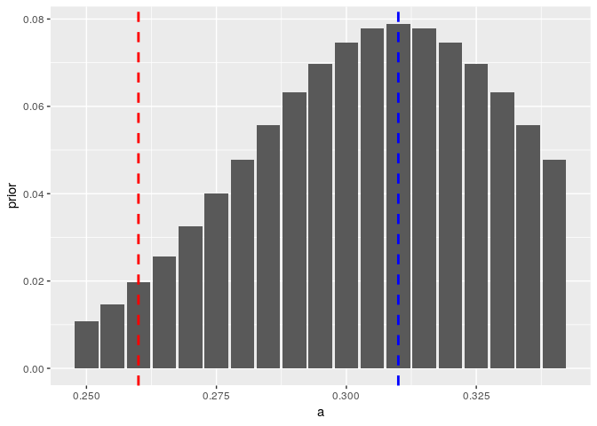

``` r
knitr::opts_chunk$set(fig.width = 7)
```

``` r
library(MDPtoolbox)
library(sarsop) # remotes::install_github("boettiger-lab/sarsop")
library(tidyverse) # for plotting
library(mdplearning)
```

# Outbreak model

  - ‘harvest’ term corresponds to removal of pest, with associated cost
  - also experience damage costs proportional to pest abundance

<!-- end list -->

``` r
damage <- 0.05
control <- 1
reward_fn <- function(x,h) - damage * x ^ 2 - control * h
discount <- 0.95


states <- seq(0,2, length=100)
actions <- states
observations <- states
sigma_g <- 0.05
sigma_m <- 0.0

r <- 0.8
K <- 1.53
q <- 2
b <- .2
eps <- states[2]
Tmax <- 100

may <- function(a){  
  function(x, h){ # May
    x <- pmax(x - h, 0)   # harvest then recruit   
    x + x * r * (1 - x / K)  - a * x ^ q / (x ^ q + b ^ q) + eps
  }
}
```

``` r
a <- 0.29
m <- fisheries_matrices(states, actions, observations, reward_fn, 
                        may(a), sigma_g, sigma_m, noise = "lognormal")
```

``` r
soln <- mdp_value_iteration(m$transition, m$reward, discount)
```

``` r
df <- tibble(state = states,
             action = actions[soln$policy],
             value = soln$V)
## tipping point at maximum action:
df %>% ggplot(aes(state, action)) + geom_point() 
```

<!-- -->

``` r
x0 <- which.min(abs(states - 0.1))
#x0 <- which.min(abs(states - 2))
df <- mdp_planning(m$transition, m$reward, discount, model_prior = c(1), 
                   policy = soln$policy, x0 = x0, Tmax = 100)
df %>% mutate(state = states[state], action = actions[action]) %>% 
  ggplot(aes(time, state)) + geom_point()+geom_path() + 
  geom_line(aes(time, action), col="blue")
```

<!-- -->

Range of possible a that covers tipping in both directions:

``` r
possible_a <- seq(.26, .33, by = 0.01)


true_a <- 0.29
true_i <- which.min(abs(possible_a - true_a))
```

``` r
models <- map(possible_a, function(a){
  fisheries_matrices(states, actions, observations, reward_fn, 
                     may(a), sigma_g, sigma_m, noise = "lognormal")
})
```

``` r
transition <- lapply(models, `[[`, "transition")
reward <- models[[1]][["reward"]]
```

## Small a assumption

``` r
mu <- possible_a[true_i - 2]
prior <- dnorm(possible_a, mu, 0.01)
prior <- prior / sum(prior)
```

``` r
barplot(prior)
```

<!-- -->

``` r
f <- may(mu)
tibble(x = states[1:80],
       f = f(x,0) - x) %>%
  ggplot(aes(x, f)) + geom_line() +
  geom_point() +  geom_hline(aes(yintercept = 0))
```

<!-- -->

``` r
sim <- mdp_learning(transition, reward, discount, 
                    x0 = x0, 
                    Tmax = Tmax, 
                    true_transition = transition[[true_i]],
                    model_prior = prior,
                    type = "value iteration", 
                    epsilon = 1e-2)
```

``` r
 sim$df %>% 
  select(-value) %>% 
  gather(series, state, -time) %>% 
  ggplot(aes(time, states[state], color = series)) + geom_line()
```

<!-- -->

``` r
 sim$posterior %>% 
  data.frame(time = 1:Tmax) %>%
  filter(time %in% seq(1,Tmax, by = 5)) %>%
  gather(param, probability, -time, factor_key =TRUE) %>% 
  mutate(param = as.numeric(param)) %>% 
  ggplot(aes(param, probability, group = time, alpha = time)) + 
  geom_line()
```

<!-- -->

## large a assumption

``` r
mu <- possible_a[true_i + 2]
prior <- dnorm(possible_a, mu, 0.01)
prior <- prior / sum(prior)
```

``` r
barplot(prior)
```

<!-- -->

``` r
f <- may(mu)
tibble(x = states,
       f = f(x,0) - x) %>%
  ggplot(aes(x, f)) + geom_line() +
  geom_point() +  geom_hline(aes(yintercept = 0))
```

<!-- -->

``` r
sim <- mdp_learning(transition, reward, discount, 
                    x0 = x0, 
                    Tmax = Tmax, 
                    true_transition = transition[[true_i]],
                    model_prior = prior,
                    type = "value iteration", 
                    epsilon = 1e-2)
```

``` r
 sim$df %>% 
  select(-value) %>% 
  gather(series, state, -time) %>% 
  ggplot(aes(time, states[state], color = series)) + geom_line()
```

<!-- -->

``` r
 sim$posterior %>% 
  data.frame(time = 1:Tmax) %>%
  filter(time %in% seq(1,Tmax, by = 5)) %>%
  gather(param, probability, -time, factor_key =TRUE) %>% 
  mutate(param = as.numeric(param)) %>% 
  ggplot(aes(param, probability, group = time, alpha = time)) + 
  geom_line()
```

<!-- -->

## Perfect knowledge

``` r
mu <- possible_a[true_i]
#prior <- dnorm(possible_a, mu, 0.01)
#prior <- prior / sum(prior)
prior <- numeric(length(possible_a))
prior[true_i] <- 1
```

``` r
barplot(prior)
```

<!-- -->

``` r
f <- may(mu)
tibble(x = states,
       f = f(x,0) - x) %>%
  ggplot(aes(x, f)) + geom_line() +
  geom_point() +  geom_hline(aes(yintercept = 0))
```

<!-- -->

``` r
sim <- mdp_learning(transition[true_i], reward, discount, 
                    x0 = x0, 
                    Tmax = Tmax, 
                    true_transition = transition[[true_i]],
                    model_prior = 1, # prior,
                    type = "value iteration",
                    epsilon = 1e-2)
```

``` r
sim$df %>% mutate(state = states[state], action = actions[action]) %>% 
  ggplot(aes(time, state)) + geom_point()+geom_path() + 
  geom_line(aes(time, action), col="blue")
```

<!-- -->

``` r
 sim$posterior %>% 
  data.frame(time = 1:Tmax) %>%
  filter(time %in% seq(1,Tmax, by = 5)) %>%
  gather(param, probability, -time, factor_key =TRUE) %>% 
  mutate(param = as.numeric(param)) %>% 
  ggplot(aes(param, probability, group = time, alpha = time)) + 
  geom_line()
```

    ## geom_path: Each group consists of only one observation. Do you need to
    ## adjust the group aesthetic?

<!-- -->
