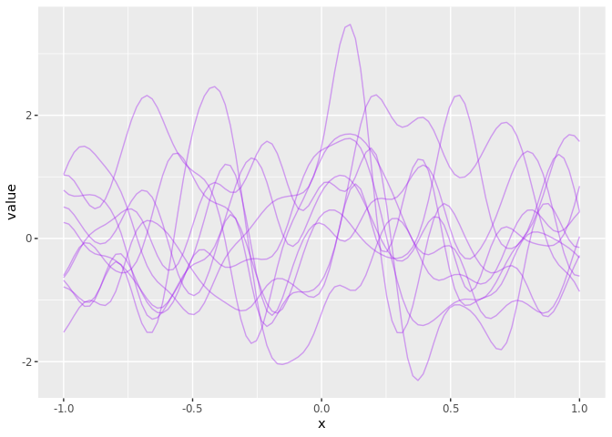
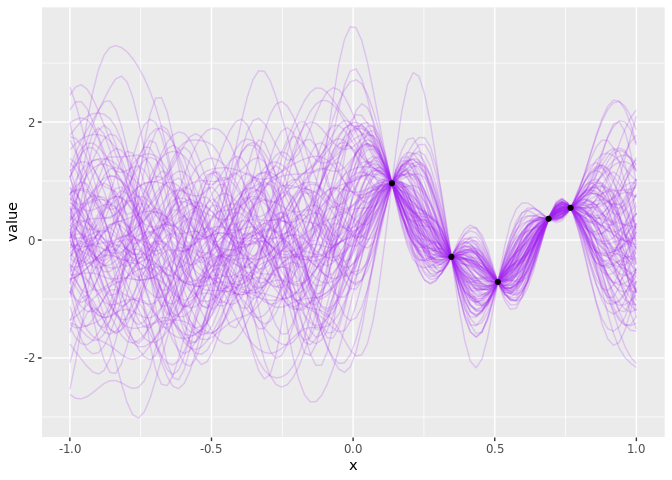
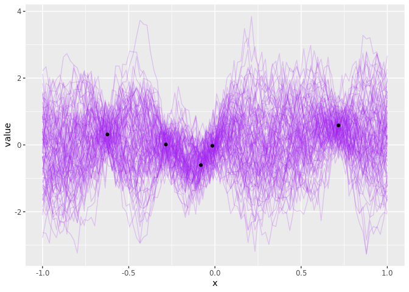
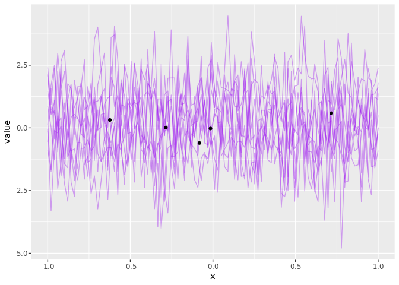

This directly maps the python code provided in the early examples of the
TensorFlow official documentation into R using `reticulate`, see:
<https://www.tensorflow.org/probability/api_docs/python/tfp/distributions/GaussianProcess>

``` r
library(tidyverse)
library(reticulate)
library(tensorflow)
np <- import("numpy")
tf <- import("tensorflow")
tfp <- import("tensorflow_probability")
sess <- tf$Session()


knitr::opts_chunk$set(error=FALSE)
```

``` r
tfd <- tfp$distributions
psd_kernels <- tfp$positive_semidefinite_kernels
```

## Draws from Prior

``` r
num_points = 100L
# Index points should be a collection (100, here) of feature vectors. In this
# example, we're using 1-d vectors, so we just need to reshape the output from
# np.linspace, to give a shape of (100, 1).
index_points = np$expand_dims(np$linspace(-1., 1., num_points), -1L)

var <- tf$constant(1.0, dtype = tf$float64)
len <-  tf$constant(0.1, dtype = tf$float64)
obs <-  tf$constant(0.05, dtype = tf$float64)

# Define a kernel with default parameters.
kernel = psd_kernels$ExponentiatedQuadratic(var, len)## Radial basis function
  #psd_kernels$ExponentiatedQuadratic()
```

``` r
gp = tfd$GaussianProcess(kernel, index_points)

samples = gp$sample(10L)
# ==> 10 independently drawn, joint samples at `index_points`
```

Or with observation error:

``` r
noisy_gp = tfd$GaussianProcess(
    kernel=kernel,
    index_points=index_points,
    observation_noise_variance=obs)

noisy_samples = noisy_gp$sample(10L)
```

Evaluate and extract results

``` r
out <- sess$run(samples) 
```

``` r
out %>% 
  t() %>% 
  as_tibble %>% 
  mutate(x = seq(-1, 1, length.out = 100) ) %>%
  pivot_longer(-x) %>%
  ggplot(aes(x, value, group = name)) + geom_line(col = "purple", alpha=0.4)
```

    ## Warning: `as_tibble.matrix()` requires a matrix with column names or a `.name_repair` argument. Using compatibility `.name_repair`.
    ## This warning is displayed once per session.

<!-- -->

## Gaussian Process Regression

This follows the examples in the official Tensorflow documentation for
Gaussian Process Regression:
<https://www.tensorflow.org/probability/api_docs/python/tfp/distributions/GaussianProcessRegressionModel>

``` r
# Generate noisy observations from a known function at some random points.
observation_noise_variance <- 0 #<-  tf$constant(obs, dtype = tf$float64)
len <-  tf$constant(0.1, dtype = tf$float64)
var <-  tf$constant(1, dtype = tf$float64)


f = function(x) sin(10 * x) * exp(-x ^ 2)
## Index points and observation_index_points is an array, with 1 col per feature! ## (N-dimensional X)
observation_index_points = runif(5L, -1, 1) %>% as.matrix(ncol = 1)
## Observations must be a numeric, not an array. (vector of values Y, not matrix of features)
observations = f(as.numeric(observation_index_points)) +
  runif(2L, 0., sqrt(observation_noise_variance)) 
```

    ## Warning in f(as.numeric(observation_index_points)) + runif(2L, 0,
    ## sqrt(observation_noise_variance)): longer object length is not a multiple
    ## of shorter object length

``` r
index_points = seq(-1, 1, len=100L) %>% as.matrix(ncol = 1) 

## This works too but no need to it in python, the above is fine!!
#index_points = np$linspace(-1., 1., 100L)  %>%  np$expand_dims(-1L)
#x = np$random$uniform(-1., 1., 5L) 
#observations = (np$sin(10*x) * np$exp(-x**2) + 
#                  np$random$normal(0., np$sqrt(observation_noise_variance)))
#observation_index_points <- x %>%  np$expand_dims(-1L)


kernel = psd_kernels$ExponentiatedQuadratic(var, len) # MaternFiveHalves()

gprm = tfd$GaussianProcessRegressionModel(
    kernel = kernel,
    index_points = index_points,
    observation_index_points=observation_index_points,
    observations = observations,
    observation_noise_variance = observation_noise_variance)

samples = gprm$sample(100L)
```

``` r
out <- sess$run(samples) 
```

``` r
ob <- data.frame(x = observation_index_points, y = observations, name = "data")

out %>% 
  t() %>% 
  as_tibble %>% 
  mutate(x = index_points) %>%
  pivot_longer(-x) %>%
  ggplot(aes(x, value, group = name)) + 
  geom_line(col = "purple", alpha=0.2) + 
  geom_point(data = ob, aes(x,y))
```

<!-- -->

## With additive noise

``` r
# Generate noisy observations from a known function at some random points.
observation_noise_variance <- 0.1 #<-  tf$constant(obs, dtype = tf$float64)
len <-  tf$constant(0.1, dtype = tf$float64)
var <-  tf$constant(1, dtype = tf$float64)


f = function(x) sin(10 * x) * exp(-x ^ 2)
## Index points and observation_index_points is an array, with 1 col per feature! ## (N-dimensional X)
observation_index_points = runif(5L, -1, 1) %>% as.matrix(ncol = 1)
## Observations must be a numeric, not an array. (vector of values Y, not matrix of features)
observations = f(as.numeric(observation_index_points)) +
  runif(2L, 0., sqrt(observation_noise_variance)) 
```

    ## Warning in f(as.numeric(observation_index_points)) + runif(2L, 0,
    ## sqrt(observation_noise_variance)): longer object length is not a multiple
    ## of shorter object length

``` r
index_points = seq(-1, 1, len=100L) %>% as.matrix(ncol = 1) 

## This works too but no need to it in python, the above is fine!!
#index_points = np$linspace(-1., 1., 100L)  %>%  np$expand_dims(-1L)
#x = np$random$uniform(-1., 1., 5L) 
#observations = (np$sin(10*x) * np$exp(-x**2) + 
#                  np$random$normal(0., np$sqrt(observation_noise_variance)))
#observation_index_points <- x %>%  np$expand_dims(-1L)


kernel = psd_kernels$ExponentiatedQuadratic(var, len) # MaternFiveHalves()

gprm = tfd$GaussianProcessRegressionModel(
    kernel = kernel,
    index_points = index_points,
    observation_index_points=observation_index_points,
    observations = observations,
    observation_noise_variance = observation_noise_variance)

samples = gprm$sample(100L)
```

``` r
out <- sess$run(samples) 
```

``` r
ob <- data.frame(x = observation_index_points, y = observations, name = "data")

out %>% 
  t() %>% 
  as_tibble %>% 
  mutate(x = index_points) %>%
  pivot_longer(-x) %>%
  ggplot(aes(x, value, group = name)) + 
  geom_line(col = "purple", alpha=0.2) + 
  geom_point(data = ob, aes(x,y))
```

<!-- -->

## ML

From:

``` r
# Define a kernel with trainable parameters. Note we transform the trainable
# variables to apply a positivity constraint.
amplitude = tf$exp(tf$Variable(1, dtype=np$float64), name='amplitude')
length_scale = tf$exp(tf$Variable(2, dtype=np$float64), name='length_scale')
kernel = psd_kernels$ExponentiatedQuadratic(amplitude, length_scale)

observation_noise_variance = tf$exp(
    tf$Variable(0.5, dtype=np$float64), name='observation_noise_variance')

# We'll use an unconditioned GP to train the kernel parameters.
gp = tfd$GaussianProcess(
    kernel=kernel,
    index_points= observation_index_points,
    observation_noise_variance=observation_noise_variance)
neg_log_likelihood = -gp$log_prob(observations)

optimizer = tf$train$AdamOptimizer(learning_rate=.05, beta1=.5, beta2=.99)
optimize = optimizer$minimize(neg_log_likelihood)


gprm = tfd$GaussianProcessRegressionModel(
    kernel=kernel,
    index_points=index_points,
    observation_index_points=observation_index_points,
    observations=observations,
    observation_noise_variance=observation_noise_variance)

ml_samples = gprm$sample(10L)
```

Note that we need to initialize variables\!

``` r
init_op <- tf$global_variables_initializer()
with(tf$Session() %as% sess, {
   # Run the 'init' op
  sess$run(init_op)
  out <- sess$run(ml_samples) 
  
  param_est <- sess$run(c(amp = amplitude, 
                  len = length_scale, 
                  obs = observation_noise_variance))
})
```

``` r
ob <- data.frame(x = observation_index_points, y = observations, name = "data")

out %>% 
  t() %>% 
  as_tibble %>% 
  mutate(x = index_points) %>%
  pivot_longer(-x) %>%
  ggplot(aes(x, value, group = name)) + 
  geom_line(col = "purple", alpha=0.4) + 
  geom_point(data = ob, aes(x,y))
```

<!-- -->

## MCMC

**Work in progress, this mapping from the python into R is not working
yet**

``` r
joint_log_prob <- function(
    index_points, observations, amplitude, length_scale, noise_variance){
  # Hyperparameter Distributions
  rv_amplitude = tfd$LogNormal(tf$constant(0, dtype=np$float64),
                               tf$constant(1, dtype=np$float64))
                               
  rv_length_scale = tfd$LogNormal(tf$constant(0, dtype=np$float64), 
                                  tf$constant(1, dtype=np$float64))
                                  
  rv_noise_variance = tfd$LogNormal(tf$constant(0, dtype=np$float64),
                                    tf$constant(1, dtype=np$float64))
                                    

  gp = tfd$GaussianProcess(
      kernel=psd_kernels$ExponentiatedQuadratic(amplitude, length_scale),
      index_points=index_points,
      observation_noise_variance=noise_variance)

  return (
      rv_amplitude$log_prob(amplitude) +
      rv_length_scale$log_prob(length_scale) +
      rv_noise_variance$log_prob(noise_variance) +
      gp$log_prob(observations)
  )
}
```

``` r
scale <- tf$constant(1e-1, dtype=np$float64)
initial_chain_states = list(
    scale * tf$ones(1, dtype=np$float64, name='init_amplitude'),
    scale * tf$ones(1, dtype=np$float64, name='init_length_scale'),
    scale * tf$ones(1, dtype=np$float64, name='init_obs_noise_variance')
)

# Since HMC operates over unconstrained space, we need to transform the
# samples so they live in real-space.
unconstraining_bijectors = list(
    tfp$bijectors$Softplus(),
    tfp$bijectors$Softplus(),
    tfp$bijectors$Softplus()
)

unnormalized_log_posterior <- function(amplitude, length_scale, noise_variance){
  
   joint_log_prob(observation_index_points, 
                  observations, 
                  amplitude, 
                  length_scale,
                  noise_variance)
  
}

num_results = 200L

# list(
  #   list(
  #     amplitudes,
  #     length_scales,
  #     observation_noise_variances
  #     ),
  #   kernel_results
  # )
```

``` r
out = tfp$mcmc$sample_chain(
  num_results = num_results,
  num_burnin_steps = 500L,
  num_steps_between_results = 3L,
  current_state = initial_chain_states,
  kernel = tfp$mcmc$TransformedTransitionKernel(
    inner_kernel = tfp$mcmc$HamiltonianMonteCarlo(
      target_log_prob_fn = unnormalized_log_posterior,
      step_size= tf$constant(.15, dtype = np$float64),
      num_leapfrog_steps = 3L
    ),
    bijector = unconstraining_bijectors
  )
)

# Now we can sample from the posterior predictive distribution at a new set
# of index points.
```

``` r
#with(tf$Session() %as% sess){
#  out <- sess$run(out)
#}
```

``` r
gprm = tfd$GaussianProcessRegressionModel(
    # Batch of `num_results` kernels parameterized by the MCMC samples.
    kernel=psd_kernels$ExponentiatedQuadratic(out[[0]][[1]], out[[0]][[2]]),
    index_points=index_points,
    observation_index_points=observation_index_points,
    observations=observations,
    observation_noise_variance=out[[0]][[3]])

## sample!
samples = gprm$sample()
```

``` r
## NOT RUN YET
samples_ = sess$run(samples)
res = sess$run(c(kernel_results = out, samples = samples))
```
