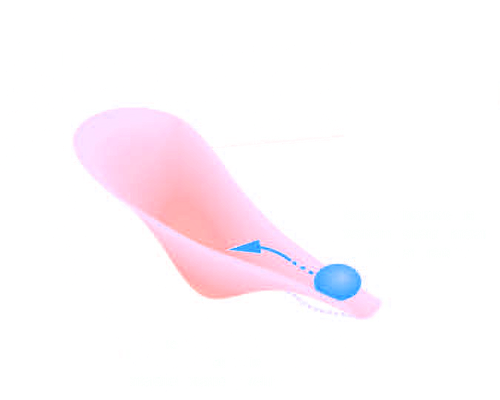

background-image: url(img/royalsociety/penguin-swim.jpg)
background-position: center
background-size: 120%
class: center, top


```{r setup, include=FALSE}
knitr::opts_chunk$set(dev.args=list(bg="transparent"), 
                      echo = FALSE, message=FALSE, warning=FALSE,
                      fig.width=11, fig.height=6.5, cache = TRUE)

library(tidyverse)
library(ggthemes)

theme_set(
 theme_bw(base_size=26) + 
  theme(line = element_line(colour = "white", size = 1.5),
        rect = element_rect(fill = "transparent", colour = "white"),
        text = element_text(colour = "white"),
        axis.text = element_text(colour = "white"),
        axis.ticks = element_line(colour = "white", size = 1.5),
        panel.border = element_rect(colour = "white", size = 1.5),
        panel.background = element_rect(fill = "transparent"),
        plot.background = element_blank(), 
        legend.background = element_blank(), 
        legend.key = element_rect(fill = "transparent", colour = "transparent"), 
        strip.background = element_blank(),
        strip.text = element_text(colour = "white"),
        panel.grid = element_blank()))

source("../R/ghost.R")
```

# Decisions vs transient dynamics: what could possibly go wrong?

???

Image credit: [Royal Society Photo Competition](https://royalsociety.org/journals/publishing-activities/photo-competition/)


---
background-image: linear-gradient(to right, rgba(150, 150, 150, .1), rgba(150, 150, 150, .4)), url(img/city-mit-license.jpg)
background-size: 140%
class: center, top, inverse

# in an era of predictive black-box models...


---
background-image: linear-gradient(to right, rgba(150, 150, 150, .1), rgba(150, 150, 150, .4)), url(img/royalsociety/pensive-polarbear.jpg)
background-size: 120%
class: center, top, inverse

# ... a need for theory & process-based models

---
background-image: linear-gradient(to right, rgba(50, 50, 50, .6), rgba(50, 50, 50, .9)), url(img/royalsociety/whale-shark.jpg)
background-position: center
background-size: 120%
class: center, top, inverse

# Ghost Attractors


---
background-image: linear-gradient(to right, rgba(50, 50, 50, .6), rgba(50, 50, 50, .9)), url(img/royalsociety/whale-shark.jpg)
background-position: center
background-size: 120%
class: center, top, inverse

# Ghost Attractors



<br/>
Hastings et al. *Science* (2018)


---
background-image: linear-gradient(to right, rgba(50, 50, 50, .6), rgba(50, 50, 50, .9)), url(img/royalsociety/snake.jpg)
background-size: 120%
background-position: center
class: left, top, inverse

# Examples 

Outbreak: disease, pest, invasive species


- Low endemic level
- outbreak
- saturation

---
background-image: linear-gradient(to right, rgba(50, 50, 50, .6), rgba(50, 50, 50, .9)), url(img/royalsociety/snake.jpg)
background-size: 120%
background-position: center
class: center, top, inverse


# A look at the model


$$X_{t+1} = X_t + \underbrace{X_t r \left(1 -\frac{X_t}{K} \right)}_{\textrm{logistic growth}}  - \underbrace{\frac{a X_t ^ Q}{X_t^ Q + H ^ Q}}_{\textrm{saturating consumption}} + \underbrace{\xi_t X_t}_{\textrm{environmental noise}}$$


---
background-image: linear-gradient(to right, rgba(50, 50, 50, .6), rgba(50, 50, 50, .9)), url(img/royalsociety/green-crested-lizard.jpg)
background-size: 120%
background-position: center
class: center, top, inverse

## Potential well diagram

```{r echo=FALSE}
p <- list(r = .05, K = 2, Q = 5, H = .38, sigma = .02, a=0.023, 
          N = 4e3, x0 = 0.2, N = 1e4)
theory(p) %>%
  ggplot(aes(x, y, col=curve)) +
  geom_line(lwd = 2)

```

---
background-image: linear-gradient(to right, rgba(50, 50, 50, .6), rgba(50, 50, 50, .9)), url(img/royalsociety/green-crested-lizard.jpg)
background-size: 120%
background-position: center
class: center, top, inverse

## Potential well diagram

```{r echo=FALSE}
theory(p) %>%
  ggplot(aes(x, potential)) + 
  geom_line(lwd = 2, col="white")

```

---
background-image: linear-gradient(to right, rgba(50, 50, 50, .6), rgba(50, 50, 50, .9)), url(img/royalsociety/green-crested-lizard.jpg)
background-size: 120%
background-position: center
class: center, top, inverse


## Dynamics from the deterministic skeleton

```{r echo=FALSE}
det <- det_sim(may,p) %>% mutate(reps=1) %>% filter(t < 3000)
det  %>%
  ggplot(aes(t, x)) + 
  geom_line(lwd = 2, col="white")
```

---
background-image: linear-gradient(to right, rgba(50, 50, 50, .6), rgba(50, 50, 50, .9)), url(img/royalsociety/green-crested-lizard.jpg)
background-size: 120%
class: center, top, inverse
background-position: center


# Under the stochastic model

```{r}
extremes <- read_csv("../data/extremes.csv")
#extremes %>%  filter(coding == "high", t < 3000) %>% pull(reps) %>% unique()

extremes %>% 
  filter(coding == "high", reps == 14, t < 3000) %>%  # %>% pull(reps) %>% unique()
  ggplot(aes(t, x)) + 
  geom_line(lwd = 2, col="white")

```


---
background-image: linear-gradient(to right, rgba(50, 50, 50, .6), rgba(50, 50, 50, .9)), url(img/royalsociety/green-crested-lizard.jpg)
background-size: 120%
class: center, top, inverse
background-position: center

# Under the stochastic model

```{r echo=FALSE}
#extremes %>%  filter(coding == "low", t < 3000) %>% pull(reps) %>% unique()
extremes %>% 
  filter(coding == "low", reps == 47, t < 3000) %>%
  ggplot(aes(t, x)) + 
  geom_line(lwd = 2, col="white")

```

---
background-image: linear-gradient(to right, rgba(50, 50, 50, .8), rgba(50, 50, 50, .95)), url(img/royalsociety/gentoo-penguin.jpg)
background-size: 120%
class: center, top, inverse
background-position: center

# Under the stochastic model

```{r}
data <- vroom::vroom("../data/reps.csv") %>% filter(t < 3000)
mean <- data %>% group_by(t) %>% summarise(x = mean(x)) %>% mutate(reps = 1)
```

```{r}
data %>% ggplot(aes(t,x, group=reps)) + 
  geom_line(alpha=0.02, color = "white")
```

---
background-image: linear-gradient(to right, rgba(50, 50, 50, .8), rgba(50, 50, 50, .95)), url(img/royalsociety/gentoo-penguin.jpg)
background-size: 120%
class: center, top, inverse
background-position: center

# Under the stochastic model

```{r echo=FALSE}
data %>% ggplot(aes(t,x, group=reps)) + 
  geom_line(alpha=0.02, color = "white") + 
  geom_line(data = mean, lwd=2, color = "white")
```


---
background-image: linear-gradient(to right, rgba(50, 50, 50, .8), rgba(50, 50, 50, .95)), url(img/royalsociety/gentoo-penguin-wtf.jpg)
background-size: 120%
class: center, top, inverse
background-position: center

# Under the stochastic model

```{r echo=FALSE}
data %>% 
  ggplot(aes(t,x, group=reps)) + 
  geom_line(alpha=0.02, color = "white") + 
  geom_line(data = mean, lwd = 2, color = "white") +
  geom_line(data = det, lwd = 2, color = rgb(.6, .6, 1)) 
```


---
background-image: linear-gradient(to right, rgba(50, 50, 50, .6), rgba(50, 50, 50, .9)), url(img/royalsociety/snake.jpg)
background-size: 120%
class: center, top, inverse
background-position: center


# Challenges to Model Inference


---
background-image: linear-gradient(to right, rgba(50, 50, 50, .6), rgba(50, 50, 50, .9)), url(img/royalsociety/reef-shark.jpg)
background-size: 120%
class: center, top, inverse


---
background-image: linear-gradient(to right, rgba(50, 50, 50, .6), rgba(50, 50, 50, .9)), url(img/royalsociety/pensive-polarbear.jpg)
background-size: 120%
class: center, top, inverse

# Descision Theory


---
background-image: linear-gradient(to right, rgba(50, 50, 50, .6), rgba(50, 50, 50, .9)), url(img/royalsociety/eagle-ray.jpg)
background-size: 120%
class: center, top, inverse


---
class: center, middle
background-image: linear-gradient(to right, rgba(50, 50, 50, .6), rgba(50, 50, 50, .9)), url(img/royalsociety/bohemian-waxwing.jpg)
background-size: 120%


# Acknowledgements

 


<!--
- Lizzie Wolkovich
- Henry Scharf
-->
