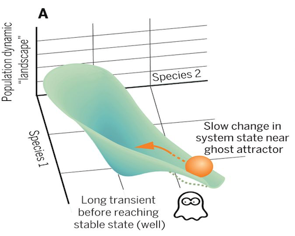

background-image: url(img/royalsociety/penguin-swim.jpg)
background-position: center
background-size: 120%
class: center, top

# Conservation decision-making under long transients

## Carl Boettiger

## UC Berkeley
---
layout: true
background-color: #fdf6e3
class: center, top

---

```{r setup, include=FALSE}
knitr::opts_chunk$set(#dev.args=list(bg="transparent"), 
                      echo = FALSE, 
                      message=FALSE, 
                      warning=FALSE,
                      fig.width=11, 
                      fig.height=6.5, 
                      cache = TRUE)

library(tidyverse)
library(ggthemes)
theme_set(theme_solarized(base_size=26))
scale_colour_discrete <- function(...) scale_colour_solarized()
scale_fill_discrete <- function(...) scale_fill_solarized()
pal <- solarized_pal()(3)

txtcolor <- "#586e75"
```

```{r}
source("../R/ghost.R")
```


```{r}
data <- vroom::vroom("../data/reps.csv.xz") %>% filter(t < 3000)
## get tail cases for comparison
ex <- data %>% group_by(reps) %>% summarise(ave = mean(x)) %>% arrange(ave)
lows <- ex %>% dplyr::slice(1:10) %>% pull(reps)
highs <- ex %>% dplyr::slice((n()-9):n()) %>% pull(reps)
```


# Decisions vs transient dynamics: what could possibly go wrong?


???

Image credit: [Royal Society Photo Competition](https://royalsociety.org/journals/publishing-activities/photo-competition/)


---

<div style='float:left;width:50%'>
  
</div>

# in an era of predictive black-box models...


---

<div style='float:left;width:50%'>
  
</div>

# ... a need for theory & process-based models


---

# Ghost Attractors


---

# Ghost Attractors



<br/>
Hastings et al. *Science* (2018)

---

# A Ghost Attractor

```{r}
data %>% filter(reps == lows[[6]]) %>%
  ggplot(aes(t, x, group=reps, col=as.character(reps))) + 
  geom_line(lwd=2, show.legend = FALSE) + 
  ylim(0,1.6) + scale_color_solarized(accent="blue")
```

---

# Simple ARIMA forecast:

```{r}
library(stats)
x <- data %>% filter(reps == lows[[6]], t < 2000) %>% pull(x) %>% as.ts() 
fit <- arima(x)
y <- predict(fit, n.ahead = 1000) %>% as.data.frame()
y <- bind_rows(data.frame(pred = x, se = 0), y)
arima_forecast <- data %>% filter(reps == lows[[6]]) %>% select(t,x) %>% bind_cols(y)
```


```{r arima_data}
arima_forecast %>% filter(t < 2000) %>%
  ggplot(aes(t)) + 
  geom_line(aes(y=x),  lwd = 1, col=pal[1]) +
  xlim(0,3000) + ylim(0, 1.6)+ ylab("x")


```


---

# Simple ARIMA forecast:

```{r arima_forecast1}
arima_forecast %>% ggplot(aes(t)) + 
  geom_line(aes(y=pred),  lwd = 1.5, col=pal[1]) + 
  geom_ribbon(aes(y=pred, ymin=pred-se, ymax=pred+se),  alpha = 0.5, fill=pal[1]) + 
  xlim(0,3000) + ylim(0, 1.6) + ylab("x")
```


---

# Simple ARIMA forecast:

```{r arima_forecast}
arima_forecast %>% ggplot(aes(t)) + 
  geom_line(aes(y=x), col=pal[2], lwd=1) +
  geom_line(aes(y=pred),  lwd = 1.5, col=pal[1]) + 
  geom_ribbon(aes(y=pred, ymin=pred-se, ymax=pred+se),  alpha = 0.5, fill=pal[1])  + 
  xlim(0,3000) + ylim(0, 1.6)+ ylab("x")


```


---

# Statistical Issues

---

# Theoretical Issues


---

### A look at a candidate model


$$X_{t+1} = X_t + \underbrace{X_t r \left(1 -\frac{X_t}{K} \right)}_{\textrm{logistic growth}}  - \underbrace{\frac{a X_t ^ Q}{X_t^ Q + H ^ Q}}_{\textrm{saturating consumption}} + \underbrace{\xi_t X_t}_{\textrm{environmental noise}}$$

```{r theory_f, fig.height=5.2}
p <- list(r = .05, K = 2, Q = 5, H = .38, sigma = .02, a=0.023, 
          N = 4e3, x0 = 0.2, N = 1e4)
theory(p) %>%
  ggplot(aes(x, y, col=curve)) +
  geom_line(lwd = 2)

```

---

## potential well diagram

```{r theory_U}
theory(p) %>%
  ggplot(aes(x, potential)) + 
  geom_line(lwd = 2,col=txtcolor)

```

---

## deterministic skeleton timeseries 

```{r det}
det <- det_sim(may,p) %>% mutate(reps=1) %>% filter(t < 3000)
det  %>%
  ggplot(aes(t, x)) + 
  geom_line(lwd = 2,col=txtcolor)
```

---

# Stochastic simulations

```{r stoch1}
data %>% filter(reps == lows[[6]]) %>%
  ggplot(aes(t, x, group=reps)) + 
  geom_line(lwd=2,col=txtcolor) + 
  ylim(0,1.6)
```


---

# Stochastic simulations


```{r stoch2}

data %>% filter(reps == highs[[6]]) %>%
  ggplot(aes(t, x, group=reps)) + 
  geom_line(lwd=2,,col=txtcolor) + 
  ylim(0,1.6)


```


---

# Stochastic simulations


```{r stoch_all}
data %>% ggplot(aes(t,x, group=reps)) + 
  geom_line(alpha=0.02,col=txtcolor)
```

---

# Stochastic simulations


```{r ensemble}
mean <- data %>% group_by(t) %>% summarise(x = mean(x)) %>% mutate(reps = 1)
data %>% ggplot(aes(t,x, group=reps)) + 
  geom_line(alpha=0.02,col=txtcolor) + 
  geom_line(data = mean, lwd=2,col=pal[1])
```


---

# Stochastic simulations


```{r wtf}
data %>% 
  ggplot(aes(t,x, group=reps)) + 
  geom_line(alpha=0.02,col=txtcolor) + 
  geom_line(data = mean, lwd = 2, col=pal[1]) +
  geom_line(data = det, lwd = 2, col=pal[2]) 
```


---

# Stochastic simulations

**First-passage times**

```{r}
## det equib
# data  %>% filter(t == max(t)) %>% pull(x) %>% mean() ## ~ 1.25

## First-passage time, tau
passage <- data %>% group_by(reps) %>% filter(x > 1.25) %>% summarise(tau = min(t))
det_tau <- det %>% group_by(reps) %>% filter(x > 1.25) %>% summarise(tau = min(t)) %>% pull(tau)
```

```{r fpt}
passage %>% ggplot(aes(tau)) + 
  geom_histogram(binwidth = 200, col=txtcolor) + 
  geom_vline(aes(xintercept=det_tau), col=pal[1], lwd=2)
```

---
class: left

## Long transient dynamics can
## also create stochastic phenomena

--

- Emergent ensemble dynamics not predicted by the deterministic model

--

- But intuition is simple: noise helps 'jump' the ghost

--

- Noise creates dynamics that are deeply challenging for both inference & decision-making... 

---

# Challenges to Model Inference


---

- Given time-series observations, can we distinguish ghost attractors from real attractors?

```{r disc_sims}
discrete_sims <- read_csv("../data/discrete-sims.csv.xz")
discrete_sims %>% filter(series %in% c("1", "2")) %>%
  ggplot(aes(time,state)) + 
  geom_line(lwd=1.5, col=pal[1]) + 
  facet_wrap(~ series)
```

---
class: left

# Model Inference

Hierarchical Bayesian estimation of stability using TensorFlow(R)

```r
library("greta")

mean <- x_t + r * x_t * (1 - x_t / K) - 
        a * x_t ^ q / (x_t ^ q + b ^ q)
distribution(x_t1) <- normal(mean, sigma_g * x_t)

a <- uniform(.25, .34) # Prior

draws <- mcmc(model(a), n_samples = 1000, warmup = 3000, chains = 4)
```


---
class: left

# Model Inference

```{r posteriors, fig.width=13, fig.height=6}
label <- c("no switch", "switch", "no ghost")
df <- c("../data/no_switches.csv.xz", "../data/switches.csv.xz", "../data/weak_ghost.csv.xz") %>%
  map_dfr(read_csv, .id = "timeseries") %>% 
  mutate(timeseries = label[as.integer(timeseries)])

inset <- discrete_sims %>% mutate(series = label[series]) %>% 
  ggplot(aes(time,state, col=series)) + 
  geom_line(lwd=1.5, show.legend = FALSE) 


p1 <- df %>% 
  ggplot((aes(value, fill=timeseries))) + 
  geom_histogram(alpha=0.9, show.legend = FALSE) + 
  geom_vline(aes(xintercept=0.27, col = "no switch"), col= pal[1], lwd=2) + 
  geom_vline(aes(xintercept=0.28, col = "no ghost"), col = pal[2], lwd=2) 

vp <- grid::viewport(width = .4, height = 0.45, x = 0.35, y = 0.7)

disp <- function(){
print(p1)
print(inset, vp = vp)
}

disp()
```


---

# Descision Theory
### Management under uncertainty
.pull-left[

## Social

### Utility fn

]
.pull-right[

## Ecological

### Transition fn

]

---

# Example systems

.pull-left[
## Outbreak


]
.pull-right[

- manage at acceptable/endemic level?
- supress entirely?

]

---

```{r results="hide"}
library(MDPtoolbox)
library(sarsop) # remotes::install_github("boettiger-lab/sarsop")
library(tidyverse) # for plotting
library(mdplearning)

damage <- 0.05
control <- 1
reward_fn <- function(x,h) - damage * x ^ 2 - control * h
discount <- 0.98


states <- seq(0,2, length=200)
actions <- states
observations <- states
sigma_g <- 0.05
sigma_m <- 0.0

r <- 0.8
K <- 1.53
q <- 2
b <- .2
eps <- states[2]/10
Tmax <- 100

may <- function(a){  
  function(x, h){ # May
    # x <- pmax(x - h, 0)   # harvest then recruit   
    x + x * r * (1 - x / K)  - a * x ^ q / (x ^ q + b ^ q) + eps - h
  }
}

possible_a <- seq(.25, .34, by = 0.005)
true_a <- 0.27   ## reality has just a transient.  use  0.277 for stronger ghost
believe_a <- 0.31 ## believe there's a strong attractor
true_i <- which.min(abs(possible_a - true_a))

```


## True model: weak ghost attractor

```{r true_a}
f <- may(true_a)
tibble(x = states[1:120],
       f = f(x,0) - x) %>%
  ggplot(aes(x, f)) + 
  geom_line(col=pal[1], lwd=2) +
  geom_hline(aes(yintercept = 0), lwd=2, lty=2) + 
  ylim(-0.06, 0.06)
```  

---

**Incorrect belief of bistable system**

```{r a29}
f <- may(0.29)
tibble(x = states[1:120],
       f = f(x,0) - x) %>%
  ggplot(aes(x, f)) + 
  geom_line(col=pal[1], lwd=2) +
  geom_hline(aes(yintercept = 0), lwd=2, lty=2) + 
  ylim(c(-0.04, 0.04))
```

---

**Incorrect belief of stronger bistable system**

```{r a31}
f <- may(believe_a)
tibble(x = states[1:120],
       f = f(x,0) - x) %>%
  ggplot(aes(x, f)) + 
  geom_line(col=pal[1], lwd=2) +
  geom_hline(aes(yintercept = 0), lwd=2, lty=2) + 
  ylim(-0.03, 0.03)
```


---
class: center, middle

# Example management scenarios

---


```{r results="hide"}
m_true <- fisheries_matrices(states, actions, observations, reward_fn, 
                        may(true_a), sigma_g, sigma_m, noise = "lognormal")


m <- fisheries_matrices(states, actions, observations, reward_fn, 
                        may(believe_a), sigma_g, sigma_m, noise = "lognormal")
soln <- mdp_value_iteration(m$transition, m$reward, discount)
opt_soln <- mdp_value_iteration(m_true$transition, m_true$reward, discount)

```

## Simulation under *no intervention*

```{r no_intervention}
x0 <- which.min(abs(states - 0.1))
no_policy <- numeric(length(states)) + 1

df <- mdp_planning(m_true$transition, m_true$reward, discount, model_prior = c(1), 
                   policy = no_policy, x0 = x0, Tmax = 100)

df %>% mutate(state = states[state], action = actions[action]) %>% 
  select(state, action, time) %>% 
  gather(series, state, -time) %>%
  ggplot(aes(time, state, col=series)) +
  geom_line(lwd=2) + 
  ylim(0,1.4)
```


---

**Mistaken ghost for alternate stable state**:

```{r mistaken_ghost}
x0 <- which.min(abs(states - 0.1))
no_policy <- numeric(length(states)) + 1

df <- mdp_planning(m_true$transition, m_true$reward, discount, model_prior = c(1), 
                   policy = soln$policy, x0 = x0, Tmax = 100)

df %>% mutate(state = states[state], action = actions[action]) %>% 
select(state, action, time) %>% 
  gather(series, state, -time) %>%
  ggplot(aes(time, state, col=series)) +
  geom_line(lwd=2) + 
  ylim(0,1.4)
```


---

## Adaptive managment: revising beliefs about the process

---

### Prior beliefs

```{r priors}
prior <- dnorm(possible_a, 0.29, 0.01)
prior <- prior / sum(prior)
data.frame(a = possible_a, probability = prior) %>%
  ggplot(aes(a,prior)) + geom_bar(stat="identity", col=txtcolor) +
  geom_vline(aes(xintercept = true_a), lwd=1, lty=2, col=pal[1]) 
```

---

### Learning too late


---

### More agnostic prior beliefs

```{r priors_wide}
prior <- dnorm(possible_a, 0.3, 0.01)
prior <- prior / sum(prior)
data.frame(a = possible_a, probability = prior) %>%
  ggplot(aes(a,prior)) + geom_bar(stat="identity", col=txtcolor) +
  geom_vline(aes(xintercept = true_a), lwd=1, lty=2, col=pal[1]) 
```

---

## Less learning, more caution

```{r}
```


---
class: center, top
background-image: url(img/royalsociety/bohemian-waxwing.jpg)
background-size: 140%

# Thanks!

---

# Acknowledgements

.pull-left[

Image Credits: 

 

**Publishing Photo Competition** 

--

- Lizzie Wolkovich
- Henry Scharf

]
.pull-right[

 


]
